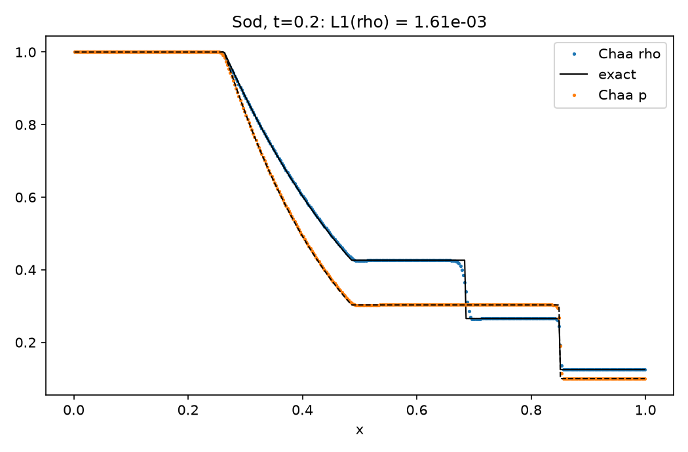
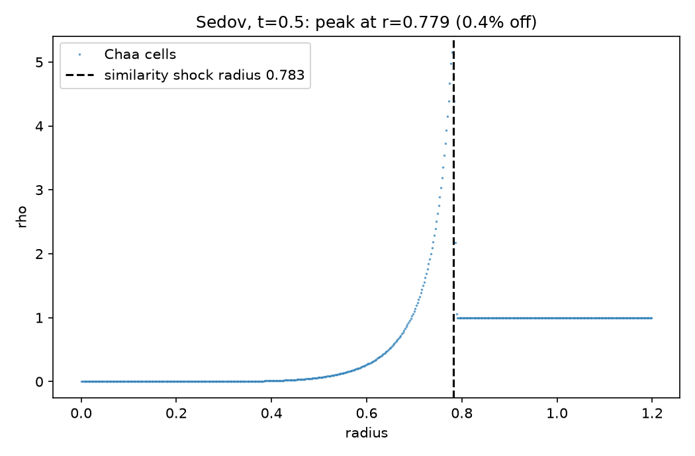
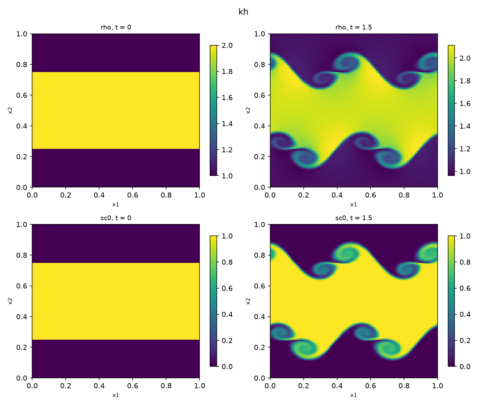
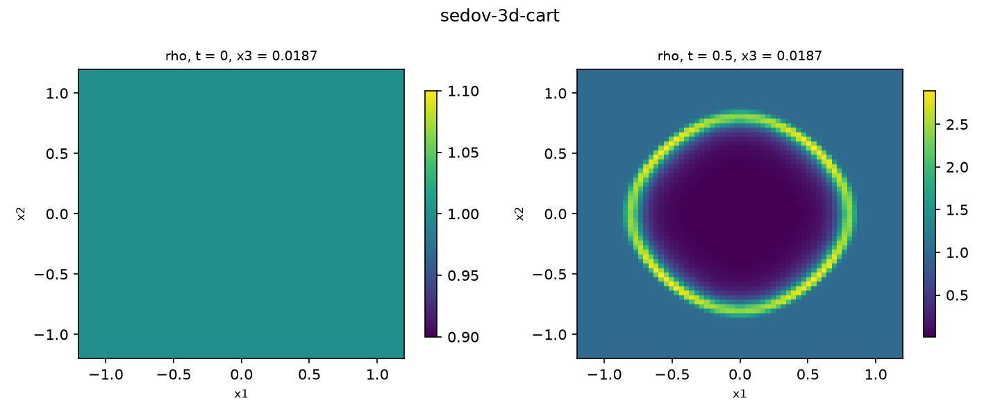
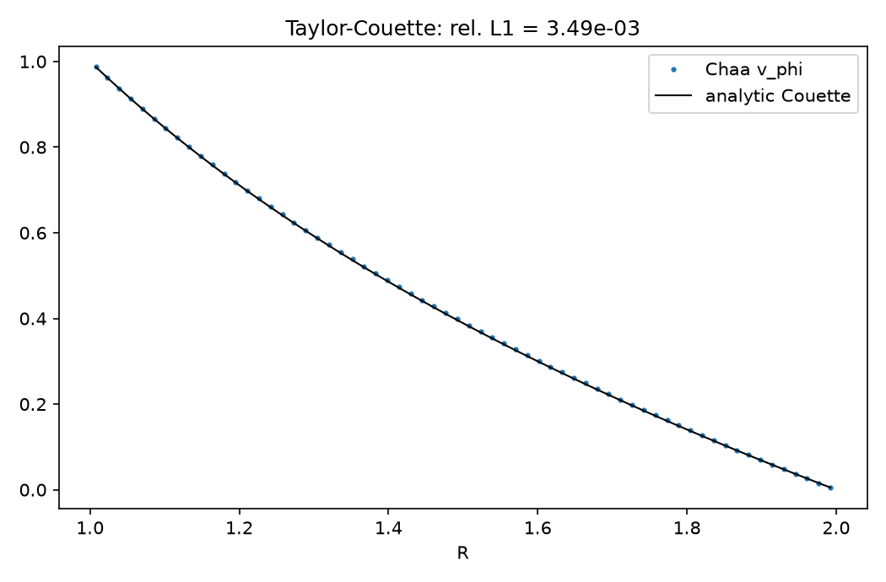
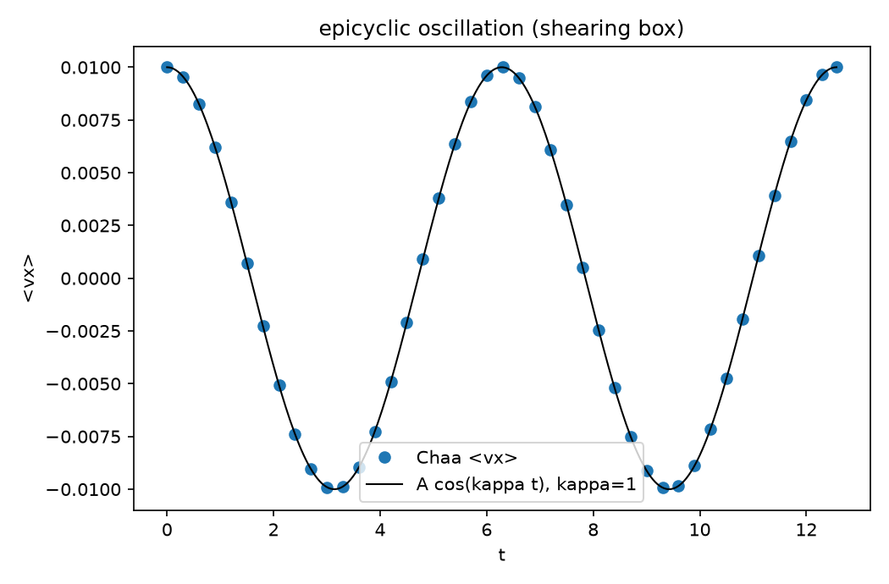

# Chaa ☕

[](https://github.com/dutta-alankar/Chaa/actions/workflows/ci.yml)
[](https://dutta-alankar.github.io/Chaa/)

**Documentation: [dutta-alankar.github.io/Chaa](https://dutta-alankar.github.io/Chaa/)** — getting started, tutorial, user guide (grid, physics modules, boundaries, particles, plotting tools, running in parallel), architecture walkthrough, benchmarks, per-test results, cross-code validation, and a step-by-step guide to setting up your own problems.

Chaa is **cross-validated against Idefix and AthenaPK**: matched-configuration runs agree to L1 = 2.7×10⁻⁴ on Sod (vs 1.6×10⁻³ to the exact solution), 0.31 % on the double Mach reflection field, and 3×10⁻⁴ on the 3D Sedov radial profile — frozen reference profiles are re-checked in CI (`tests/reference/`).

```text
⢰⠢⡑⣎⡱⢣⡑⡎⢥⣃⠳⣌⠳⣘⡜⢢⡝⢢⢣⡙⠦⣙⢆⡳⢌⢣⣃⠳⣌⢱⢊⡼⡑⢎⡜⣡⢎⡱⢊⡕⢪⠜⣢⠙⡦⡙⡜⢢⢇⠣⢎⡱⢊⡜⣌⠞⡰⢩⠲⣡⢓⡬⢓⢬⡑⢣⢎⡱⣌⠳⣌⠳⣌⠥⣋⠴⣉⠦⡙⡴⣉⠶⡑⣎⢱⡊⣕⢪⡑⢎⠥⡓⡜⢬⢒⣍⠲⣉⠖⣡⢋⡬⣑⠎⡜⢆⢣⡓⣌⢣⠚⣌⢣⡙⢆⡣⢳⡘⡜
⢢⢣⡙⢤⡃⢧⡘⡍⠦⢥⡓⢬⠓⢦⠸⡡⢎⠥⢣⢩⡑⢇⠎⡴⢩⡒⣌⠳⣈⠦⣍⠲⡩⢌⡲⢅⡚⢴⠩⡜⣡⠞⡰⢩⠒⡥⢛⠴⣊⡍⢎⠱⡩⠜⡤⢓⡍⢖⡙⠆⠣⢜⡊⢦⡉⢇⡎⠖⣌⠳⢌⡲⡡⢎⡱⢊⡴⡙⠴⡱⢌⡖⡩⢆⢣⠜⡤⢣⢍⠮⣘⠥⣩⠒⡥⢊⠵⡘⢎⡡⢃⡖⣉⢎⡹⢌⠣⡜⡌⣎⡱⢊⠵⣈⠧⣑⠣⣜⠸
⡘⢦⡙⢦⡙⢢⠓⡜⢣⠎⣜⢡⡋⡖⢭⡑⢎⡱⣉⢦⡙⡌⡞⡌⢧⡘⠴⣉⠖⡱⣌⢣⡙⢆⠳⢬⡘⢆⡛⡔⢣⢣⠹⡡⢏⣨⡥⠗⣒⠺⣌⠣⡕⢭⠲⡑⠊⠈⢀⣀⣀⣀⠀⠁⠚⡥⣊⡝⢢⠝⣪⠱⡜⢬⢪⢱⢢⡹⣌⠱⡎⡴⢣⡙⣌⠳⣌⠣⢎⡜⡜⡸⡰⡙⢴⠋⡖⡙⢦⡙⢥⠚⡔⢪⢔⣊⠳⡑⢎⡴⣉⠮⣑⢎⡱⣡⢋⡖⢭
⢜⢢⡙⠦⣩⢣⡙⢬⢃⡞⢔⡣⠜⡜⢆⡙⢦⡱⢊⢦⠱⡑⢎⡜⢦⡙⢎⡱⣊⠵⢌⠦⡙⢎⡱⢦⠹⣌⠲⣩⢃⠏⡕⣱⣯⠋⡴⣉⢎⡳⢌⢳⣘⢣⠳⠁⢠⣾⣿⢿⣿⣻⣿⣶⡀⠀⠧⡜⢣⢎⡥⠣⢝⣊⣒⠣⡓⠴⣊⠵⢣⡜⢥⠓⣬⠓⣬⠙⡆⠞⡴⢃⢳⣉⠖⣩⢒⡙⡢⢍⢆⡛⡌⢇⡎⡔⢣⡙⢆⡲⢜⢢⠕⡪⠴⣡⠳⡘⢦
⡘⢦⢩⢒⠥⢆⡙⢆⠧⣘⠦⡱⡙⡜⢪⢜⡡⢎⡱⢪⠱⡙⢖⡸⢆⡱⢎⠖⣉⢎⢎⠖⡙⢦⡙⢆⡳⢌⡕⣢⢏⠞⢸⣯⡏⡰⢣⠜⠊⠘⠎⡵⢊⡼⠁⠀⣿⠋⢁⢀⠈⠹⣞⣿⣿⡄⠈⣜⠣⢎⡜⡱⢋⢭⡙⢷⡌⢳⢩⡜⢣⠎⢧⠹⣄⡛⣤⠛⣜⡹⢰⢋⡖⣌⠚⡥⢢⠱⣑⠎⢦⡑⡺⡐⢮⡘⣥⠙⡜⣰⢃⢎⡹⢔⠫⡔⢣⡝⡲
⡘⢆⠧⢎⢣⠞⡸⣌⠲⡅⣎⢱⡑⣊⢇⡎⢴⠣⡜⣡⠫⢜⠪⡔⢣⡱⢪⡜⠴⢪⠜⣪⠙⣦⢉⠶⣡⠳⣜⡡⢎⡝⠘⣷⣷⠈⡇⠰⣍⠖⡄⠈⡳⣌⣓⡀⠻⠀⢭⡚⡴⠀⢸⢿⡼⣧⠀⢨⠝⣎⠤⡃⢚⡆⡣⣼⡇⡙⢦⡍⢧⡚⡥⢏⢦⡱⣊⡝⣢⡱⣋⠶⡱⢌⢣⡜⢣⢓⠬⡱⢆⡱⢥⡙⣢⠱⣌⠣⡝⢤⢋⠴⡘⣌⠳⣌⢣⠎⡵
⢸⠡⠞⣡⢎⡱⠱⣌⢣⡑⢎⠦⡙⡴⢊⡜⢆⢏⡲⢡⢋⡜⢥⡙⢦⠱⢣⠜⣙⠦⣋⠴⣉⠦⣩⠖⣡⢏⡴⡙⣎⠼⡀⠙⢾⡷⣍⠔⢮⡹⢜⡀⢱⡒⣜⢢⠦⣄⢧⡙⣖⠀⢸⣽⣟⡇⠀⡸⣘⢦⢫⡜⠣⣪⣴⠟⡠⡝⣢⡙⢦⢣⢝⣊⠖⡱⢥⡚⢥⠳⣌⢣⡙⣬⠣⢎⡓⣌⠧⣑⠎⣔⠣⡜⡰⢍⢆⡣⢝⠢⡍⢎⡱⢌⠳⡌⠶⡩⢖
⢌⠧⣙⠔⣊⢜⡱⣌⢲⡉⠖⡥⢓⣌⠣⢜⣊⠦⡱⢩⠆⣝⢢⡹⣌⠳⡍⡞⡜⢮⡱⢚⣌⠳⢥⣚⡱⢎⡴⡙⣆⢯⠱⣄⠈⠻⣟⣮⢢⡙⢮⠀⢮⡱⢌⣓⠮⡜⢦⡹⠀⢀⣾⣟⣾⠃⢀⡕⡎⡖⡱⣠⠾⡋⢴⡸⢡⢓⠦⡙⢎⡚⢦⠥⢫⡕⢎⡝⢪⡕⠮⢥⡛⢤⣋⠶⡩⢆⡳⢌⡓⣌⠳⢬⡱⢊⢖⡱⢊⠵⣘⠣⡜⣌⠧⡙⢖⡩⢎
⡘⡲⣑⠎⣕⠪⡴⣘⢆⡹⠸⡐⠧⣌⡙⡆⢎⠖⣍⠶⡙⢆⢧⠱⢎⡱⡹⢴⡙⢦⡱⣋⠴⣋⠶⣡⠝⠎⠒⠙⢦⢋⡕⢦⣃⠀⢹⣽⡆⡹⡌⢌⡲⢍⡞⢴⢫⠜⠃⢁⣰⣿⣻⣽⠏⠀⡔⢮⡱⣙⠖⡇⠮⡜⣣⠕⣫⢍⡞⡹⢬⡙⢮⡑⣇⠞⡱⢪⡕⢮⡑⣎⠼⣡⠎⡼⡑⢮⠜⡣⡜⡤⢋⠖⣘⠎⢦⡑⣋⠖⣡⢣⠱⡌⢖⡩⢎⡕⣎
⣘⠱⣌⠚⣤⢓⠲⣌⠲⡱⣩⣑⢣⢆⡕⢪⡱⣚⠴⢣⠝⣎⢮⡙⢦⡱⣓⢮⠱⢎⡴⢣⠳⣌⠳⠁⣠⠲⡔⡤⡀⠈⠸⢥⡚⡄⢀⣿⡅⢣⢜⠣⡝⢪⡜⠃⠁⣠⣴⡿⣟⣷⣿⠉⢀⡜⢬⢣⠓⠎⠳⣤⢳⠱⣎⡹⣒⠎⡖⢭⠲⡍⠶⣑⠮⡙⢮⡱⢎⢧⠱⢎⡓⢦⠹⢴⡙⢦⡙⢆⡳⢌⡣⣙⠦⡙⢦⡑⢎⡬⢱⢊⡵⣉⠦⢳⡘⢲⢌
⢌⠳⢌⠳⣄⢋⠶⣌⡱⡱⢢⡜⢦⢊⡜⢥⡒⣍⢎⡳⢚⠴⢣⡹⢆⡳⢎⢮⡙⣎⠖⣣⠳⣜⠃⠐⢦⠛⠨⣕⢣⠀⠈⡳⡜⠁⣸⣯⠱⣉⢎⡳⡜⠁⢀⣴⣿⡿⣽⣟⣯⡷⠁⠠⠒⢈⣀⣀⣤⣀⣀⡀⠈⠳⣬⢱⠃⠨⣝⢪⡝⣜⢣⢣⠏⣝⠲⡙⣎⢎⡝⢦⡹⢌⢏⡲⢩⢆⡹⢎⢖⡩⢖⡑⢎⡱⢢⡙⠴⣈⢇⠣⢆⠵⣊⠧⣘⠣⢎
⢌⡓⣎⡱⢜⣌⠲⣄⢣⡱⡱⣘⠦⡩⡜⢦⡙⣬⢚⡜⡭⣚⡱⢍⠶⣙⢎⠶⣑⠮⣙⠴⣋⡼⢩⢆⡀⣁⠼⣨⢓⠀⢠⠳⠁⣰⣿⠂⢞⡱⢪⠅⠀⣴⡿⣯⡿⢟⣹⣾⠉⠀⣀⣴⣾⣿⡻⠟⢾⣟⣯⡿⣷⡀⠀⢧⢣⠈⢒⢧⡚⣬⠣⢇⡻⢔⡫⣕⠎⡞⡜⢦⡙⣎⠮⡱⣋⠮⡱⢎⡚⣌⠳⣌⢇⢎⡱⢌⠳⣈⢎⡱⢊⠞⡤⣓⢬⡙⣬
⡜⡔⢢⠕⡪⢔⠣⢎⠆⣇⠱⡥⢎⠵⣉⢖⡹⢔⢣⠞⡴⢃⡳⡜⢮⡱⣊⠷⣡⠹⣌⢳⡱⢎⡓⢮⡱⢍⢶⡡⠏⠀⣨⠃⣰⡿⢂⡝⣢⢝⡃⠀⣼⣻⢿⡟⢁⣾⡿⠀⣠⣾⣿⠟⠉⢁⡀⣀⣀⠀⠑⢿⣽⣧⠀⢨⡓⣆⠀⢮⠱⣜⢣⢏⡜⣣⠕⡮⣜⡱⣙⠦⡝⡬⢳⢥⡙⢲⡱⢪⡕⡪⢕⢎⡜⣪⠑⣎⢑⢣⡊⠼⣉⢖⡱⣌⢲⣉⠖
⡘⣌⢇⠞⣡⢋⠼⣨⠓⣌⡓⡜⡰⣍⡚⡬⢜⠮⡑⢮⠱⣋⠶⣙⢦⢳⢡⠏⡶⣙⢬⣃⢗⣣⠹⢦⡙⣎⠶⡱⢃⠀⠧⠀⣿⠇⡜⡜⡆⢯⠄⠀⣟⡿⡟⠀⣾⣿⠁⣼⣿⠛⠁⡠⢜⠦⣣⠳⣌⠳⠀⢸⣷⡟⠀⡰⡚⡼⡀⠰⣋⠼⣘⠶⣘⢥⡚⡵⣂⠷⡱⢎⡵⡙⢦⠳⣜⢣⡚⡵⣌⠵⣩⢎⠼⣰⢩⠆⡭⢢⢍⠳⡌⢦⠱⣌⠖⣌⠞
⡑⢎⢬⢊⡕⢪⠜⣤⠋⡴⣘⠴⣃⠖⣱⡙⣎⠺⣑⢎⡣⢇⠻⣌⢎⢦⢫⢜⡱⢎⠶⣉⢦⢣⡝⣱⡚⣬⠓⣍⠳⡄⠘⡄⢿⣳⡘⣌⠳⡭⡄⠀⢫⣿⣇⠀⣿⣶⠰⣯⡏⠀⡜⣜⢣⡛⠀⣶⡈⢁⣠⣿⡷⠁⢠⡱⢹⡔⢁⢲⣉⢞⡱⢪⢍⡖⢭⠲⣍⡚⣥⢫⡔⡻⢬⠳⣌⠧⡹⣔⢪⡱⢣⢎⢳⡘⢦⡙⡰⢃⣎⠳⡌⢇⡳⢌⡚⣤⢛
⠱⢎⡜⡜⡱⢊⠴⡩⡒⣅⠫⢆⡝⡲⣍⠳⣙⢦⡹⢜⣣⢚⢦⡙⡞⣜⠪⣜⢣⢞⡰⢋⡜⢮⡱⢋⡵⣩⠶⣙⢦⠓⡤⢁⠜⢿⣧⠙⣦⠣⢧⠀⠘⣿⣟⡀⢻⣿⣶⢿⠁⢰⡱⣙⢎⡳⠀⠻⢷⣾⠿⠏⠁⡠⣌⠳⢎⡡⡜⣬⢛⠬⣓⠮⡜⡱⢎⠶⡩⢧⡙⣎⠵⢣⡜⡢⠝⣔⢣⡝⣊⠗⢮⡘⡎⡵⢊⡕⢣⢎⡙⢦⠱⡜⡡⢎⠳⣉⠞
⢩⠖⡸⢬⢱⢩⢒⠵⡱⢌⡹⡌⢖⡱⣌⠳⡍⢦⠓⡭⠲⣍⠶⣩⠜⣲⠹⣌⠧⣎⠱⣋⡼⣒⢭⠳⡜⡥⢞⡱⢪⠝⣜⢣⠞⣤⠙⢷⡔⣋⢎⢧⡀⠈⢿⣷⡈⢷⣻⣿⡀⠐⢧⡙⢮⡑⢧⠤⣀⡀⣠⢄⡞⣰⢃⡻⣜⠲⣙⢆⡏⡞⣌⠖⣭⢣⢏⡼⢱⡪⣕⠪⣍⠳⡜⣥⢛⡬⢲⢱⢪⡙⢦⡹⡘⡴⢃⠮⣑⢎⡱⢊⠶⡱⢱⢪⠱⢎⡚
⠸⡌⣕⢊⠦⣍⢲⡘⠴⣉⠖⣍⠞⡴⢊⡵⢪⡱⢫⡜⣳⠘⣎⢥⠫⣕⠫⣜⡚⣤⢳⠱⣚⡜⡪⢧⠹⣌⡳⢜⡣⢛⡴⢋⡞⡴⣋⡆⢻⡌⠞⢦⢓⡄⠀⠙⣿⣎⣿⡽⣇⠀⢸⡙⡦⡝⣎⠮⢱⡙⢦⢫⡜⢥⣋⠶⣉⠎⡵⢪⡜⡱⢎⡝⢦⡓⢮⠜⣥⠳⣌⠳⣍⡣⣝⢢⢇⡞⣡⢣⠳⣜⢣⢲⡱⣡⢋⡜⢥⢊⠶⣩⠲⣡⠳⢬⡙⢦⡙
⢱⡉⢦⠩⡖⡌⢦⡙⢲⣉⠞⡴⡙⢴⡋⡴⢣⡍⢧⡜⢦⠛⡜⢦⢛⣌⠳⡜⡜⣤⣋⢧⡓⡼⡱⣃⢟⣰⠹⢎⡵⣋⠶⣍⠞⠴⠃⠞⠉⣷⠘⠃⠋⠘⠓⠀⠈⠻⣾⣻⣟⡆⠀⠙⠒⢡⡶⠡⠧⠙⢎⠧⡜⢧⢎⡳⢍⠾⡱⢣⡍⢧⢫⡜⣣⠹⣌⠳⣌⠣⣜⠳⡬⡱⢎⡕⢮⡸⣅⢧⠳⡌⢧⠣⡵⢡⠎⣜⢢⡙⠦⣅⠣⡥⡓⢦⡙⢦⡙
⣡⠚⡥⢳⡘⢥⠣⢍⡣⢌⡳⠜⣍⠦⣓⡱⢣⢚⢦⠹⣌⢳⡙⢦⠣⡜⣣⠝⡜⢦⡱⢦⡙⢶⡱⡍⡞⠌⠛⠈⠀⠁⠀⠀⣀⣀⣀⣀⣠⣿⣤⣤⣤⣤⣤⣤⣄⠀⠹⣧⢿⣧⠀⢠⣤⣼⣥⣀⣀⣀⣀⠀⠀⠁⠈⠁⠋⠚⠵⡫⡜⢦⠳⣜⣡⢛⣬⢋⠶⡹⣌⠧⣱⡑⢯⣘⢣⢳⡘⡬⢣⠝⣪⠱⣍⠧⡙⣔⠪⢜⡱⢌⠳⣰⠙⢦⡙⢦⡙
⢤⢋⠖⣡⠞⡰⢋⡜⡔⢫⢔⡫⡜⢎⡴⣩⢇⠫⣆⢛⡬⠲⣍⠶⣙⠼⣡⢛⡜⣣⠝⣦⠹⠂⠁⠀⢀⣀⣤⣤⣶⣾⠿⠿⢛⠛⡛⢍⡉⢿⡍⢉⠍⣉⠖⡰⣈⠄⠀⢻⣿⡍⠀⢨⢉⡙⣏⠉⣉⠛⠛⡛⠿⠷⣶⣦⣤⣀⡀⠀⠈⠁⠛⠦⣙⢎⠦⣍⠶⣱⢊⢮⡱⣙⢦⡙⢦⠳⣜⡱⣍⠮⣑⢣⢎⢣⠝⣌⢣⠣⡜⢪⡑⢦⡙⢦⡙⠴⣩
⢢⢋⡜⢢⡙⡬⢃⠖⣩⠎⣲⢱⡙⠮⠴⣑⢎⡳⢌⡳⢜⡳⢜⡚⡴⢫⡔⣫⠜⡥⠋⠀⠀⣠⣴⣾⡿⠟⠙⡉⠥⣐⠢⡑⢎⡰⢉⠆⡔⢢⠙⠒⠌⠤⠣⠑⠤⠉⠀⢸⣟⠃⠀⢦⠘⢤⢂⠵⣁⢎⡱⢌⡒⡜⢠⢌⠩⢋⠻⢿⣶⣤⡀⠀⠉⢮⠹⣌⡳⣌⢫⡲⡱⣍⢦⡹⣉⠗⣬⠲⣜⡲⣩⠎⣎⢎⡚⣤⢣⢓⡌⢧⠙⢦⡙⣤⢙⡚⡴
⢌⡣⢚⢥⡱⢌⠧⡙⢤⠫⣔⢣⡙⣎⢧⡙⣜⠢⣏⡜⢣⢎⠧⣙⢖⡣⢞⢥⠫⠀⠀⣰⣾⡿⠉⢀⡠⠜⡱⣈⠕⠢⠱⠉⠂⠑⠈⠈⠀⠀⠀⠀⠀⠀⠀⠀⠀⠀⢀⣿⠋⠀⠀⠀⠀⠀⠀⠀⠁⠐⠁⠂⠱⠈⢖⡨⢃⠎⡔⣀⠉⠺⣿⣦⡀⠀⠱⣊⡵⣌⠳⣌⠳⣌⠶⣡⠏⡞⣔⢫⡔⠣⢧⡙⢦⢣⡙⢤⢃⢎⡜⢢⠝⣢⡑⢦⣉⠖⣱
⢸⡐⣋⠦⣑⢎⡱⡙⢆⠻⡔⣣⢝⣢⢣⡝⣌⠳⢴⣩⠓⣎⠵⣩⢚⡜⣎⢞⠀⠀⢸⣿⢿⠀⠀⣎⠔⠋⠀⠁⠀⠀⠀⠀⠀⠀⡀⢀⠀⡄⠠⠀⠄⠠⠀⢀⠀⣠⠟⠁⠀⠀⠀⠀⠀⠀⠄⢀⠀⡀⠀⠀⠀⠀⠀⠈⠈⠘⠔⠣⡄⠀⢹⣷⡇⠀⠀⣱⢒⢭⠳⣌⠳⣎⠵⢣⡛⡼⣌⠳⣌⢳⠪⣕⣋⢦⡙⢆⢏⠲⣘⠣⢎⠥⡜⢦⣘⢣⢣
⢢⢃⢇⡚⣱⢊⠴⡙⢬⠓⣍⡒⢮⢔⡣⡜⣬⢛⡴⢢⠟⡜⢮⡱⢫⡜⡜⢮⠀⠀⠈⢿⣿⡄⠀⠀⠀⠀⠀⠀⠀⠠⢀⠐⡈⠐⠀⠁⠀⠀⠀⠄⠀⠐⠀⠔⠊⠁⠀⢀⠀⠂⠈⠁⢂⠐⠠⠀⢀⠀⠂⠄⠀⠂⠀⡀⠀⠀⠀⠈⠀⣠⣿⡿⠀⠀⠀⢶⡩⠖⠋⠜⠓⠊⠓⠣⠝⢦⣍⠳⣌⢧⡓⡜⡴⢣⠜⡣⢎⠳⡌⠳⡜⢪⡜⢆⡜⡆⢧
⠸⡌⢦⡑⢆⡋⠶⣉⢆⠻⠴⡙⡖⢮⢱⡙⣤⢫⠲⣍⠾⣸⠱⣎⠳⣜⡹⢲⠀⠀⢀⠀⠙⠿⣷⣄⡀⠀⠀⠐⠀⠠⠀⠡⠂⠤⠐⢀⠁⢡⠂⢄⢈⠀⡀⡀⡀⠐⣀⠀⡀⠂⡁⠄⠂⠌⠁⠀⠀⠠⠀⠉⠀⠀⠀⠀⠀⠀⠀⣤⣾⡿⠋⠀⡀⠀⠀⠂⠀⠀⣀⣠⣤⣤⣄⣀⠀⠀⠈⠳⣜⢢⠳⡍⢶⠩⢎⡕⢪⡑⢮⠱⡜⡡⢎⢲⡸⡘⡥
⠱⢎⠥⡙⢦⡙⠼⡰⣊⠵⣋⠼⣩⢎⢧⡙⢦⣍⠳⣌⠳⣆⢟⡰⢯⡜⣜⣣⠀⠀⠐⠮⣄⢤⣈⡙⠿⢷⣶⣤⣀⡀⠀⠀⠀⠀⠁⠀⠈⠀⠈⠂⠈⠐⠐⠀⠐⠁⠂⠈⠀⠁⠀⠀⠀⠀⠂⠀⠁⠀⠀⠀⠀⣀⣠⣤⣶⡆⠀⠈⣅⣀⢤⢓⡄⠀⠀⣠⢸⣿⡿⠿⠿⠽⢯⣿⢿⣶⣄⠀⠈⢪⠵⣙⢎⢳⢣⡜⡱⡘⣆⠳⣌⢱⡩⢆⡱⡱⢣
⡙⡌⣎⡱⢣⠜⣣⠱⡜⢆⢣⠛⡴⣊⠶⣩⠲⣌⠳⣜⢣⡚⣌⢗⡪⣜⢢⡳⠀⠀⢸⠱⢬⢸⢿⣿⣷⣷⣻⣯⣟⣿⣿⣷⣶⣦⣤⣤⣤⣄⣀⣀⣀⣀⣀⣀⣀⣀⣀⣀⣀⣀⣀⣀⣠⣤⣤⣤⣴⣶⣶⣿⢿⢿⣿⣽⣯⣿⢀⠀⢸⣻⡆⡍⠆⠀⠀⠥⣜⠡⠔⠒⠀⠚⠰⢂⠝⢿⣿⣧⠀⠀⢣⢝⡪⡜⣲⠘⡥⢓⣌⠣⡜⢢⡑⢎⢲⡑⢧
⢸⠰⢆⠵⣉⠞⡤⢓⡍⢮⣡⢛⡴⣉⢖⡣⡝⠼⣉⠞⣦⠹⡜⢦⠳⡜⣣⢝⠀⠀⠠⢏⡲⢸⣯⣟⣾⣽⣻⣾⣽⢿⣾⣽⣞⡿⣟⣿⣯⣿⢻⣟⣿⢿⡿⣟⡿⣿⣻⣿⣟⡿⣿⣻⡷⣿⣻⣽⢾⣻⣷⡿⠟⠉⠀⠀⠈⣯⡇⡄⠀⣿⡇⡸⡁⠀⠀⡓⠀⢀⣠⢐⡲⢤⠄⠀⠘⡄⢳⣿⣇⠀⠈⣆⠧⡙⣆⢫⢒⠣⢌⡣⢍⡣⢎⡍⡖⡩⢖
⢌⡓⢮⡘⠼⡘⣌⠣⡜⢢⠥⣓⢬⢓⡎⡵⣩⠳⣍⠾⡰⣋⠞⣭⢓⡝⢦⣋⠆⠀⢈⡳⢜⣼⢷⣿⣾⡷⠛⠉⠀⠀⠀⠀⠉⠛⢿⠉⣷⣿⢿⣽⢯⢿⣟⣿⣽⣿⣻⣞⣿⣻⣯⠁⠀⠀⠀⠉⣿⣯⡟⠁⣠⣶⡆⠀⢀⣏⣯⠀⠀⢽⡇⣡⠃⠀⠀⠀⢀⡳⢆⠯⣜⢣⢏⠆⠀⢘⡂⣿⣿⠀⠀⡜⠼⣱⢊⡇⢎⡹⡘⡔⡣⡜⢆⠞⡬⡱⢩
⡘⡜⢢⡙⢲⡉⢦⡹⡘⣎⠵⡩⠖⡭⡚⣥⢣⠳⡜⢎⡵⡩⢞⡔⣊⢞⡱⢎⡆⠀⠨⢖⡩⢼⣿⣿⠊⠀⠀⠀⣠⣶⣿⣿⣶⠄⠀⠀⢻⡯⠟⠉⠀⡀⠀⠀⠉⠑⠻⢿⣽⣳⣿⣤⣨⣿⠇⠀⡯⠋⣠⣾⡟⠋⠀⣠⣿⣯⣿⠐⠀⢸⢡⢖⡁⠀⠀⣀⠫⡜⣭⢚⡬⣓⢎⡳⠀⢀⠆⣟⣿⠀⠀⣍⢳⣡⢚⢬⢃⡖⢥⡙⠴⣉⠮⡜⣡⠓⡭
⢸⢡⡓⣌⠧⣘⠥⣒⠭⣘⢖⡩⣝⣡⢛⡤⢣⢛⡬⢳⠸⣥⢋⡼⣘⢮⡱⢏⠄⠀⠘⢦⣙⢸⣿⠀⠀⠀⢀⣾⣻⢷⡿⠚⢹⣿⠀⠀⣾⣏⠀⠰⢎⠻⣿⡿⣶⣦⣤⣀⡀⠉⠉⠉⠉⣁⣠⣾⣴⣿⣉⠁⠀⠀⠀⣿⢯⣿⣻⠠⠀⠘⢘⠮⡀⠀⠠⡝⢮⡱⢎⡳⣜⡱⢎⠅⠀⡰⢰⣿⡏⠀⠠⡜⢦⡱⢎⡆⢫⡰⣡⢎⢣⡑⢎⡴⢡⢛⠴
⡘⠦⡱⢌⡚⡔⢣⡜⢲⡉⢮⡔⡎⢦⢣⢚⡥⢣⡚⣥⢛⡴⢋⠶⣩⢖⡹⢎⡇⠀⢘⠦⡜⢸⠇⠀⠀⠀⣾⡽⣽⡯⠀⢰⣿⡛⠀⢠⣽⣿⢶⣤⣴⣾⢷⣿⣽⣷⠟⢿⣟⡏⠙⠙⠉⢁⣾⣯⣷⢿⡟⠀⠀⠀⠀⢹⣿⣯⡿⠇⠂⠀⠀⠑⠀⠀⢏⡜⣣⠝⣮⠱⣎⠵⠋⠀⠠⢄⣿⡯⠁⠀⠴⣙⢦⡱⢪⢜⢣⠒⡥⢎⢆⡹⢢⠜⣡⢋⡜
⢌⡇⢇⢣⠕⡪⠕⡬⢣⠜⣣⠜⣩⠖⡭⣚⠬⢇⡹⣔⢫⡔⣏⢞⡱⢎⡳⣍⠖⠀⠈⡜⢼⠸⠀⠀⠀⢰⣿⣟⣿⣗⡀⠀⠁⠀⣠⣾⠛⠚⠛⠋⢁⣿⣄⠀⠀⠀⣰⣟⣿⣯⠀⡀⠀⠈⣷⣯⣿⣿⠃⠀⣧⠀⠀⠈⣿⠞⠁⠀⠀⢀⠄⢄⠀⠀⢩⢜⡣⡝⢦⣛⢬⠋⠀⣀⢣⣾⣿⠁⠀⣈⢞⡱⢪⡕⡫⠜⣆⠛⡴⣉⠦⡱⢅⡚⢥⡚⡜
⠲⡌⢭⢂⢏⡱⡙⠴⡑⢮⣡⡛⡴⡋⠶⣱⢊⣍⠶⣌⢳⡸⡜⡎⡖⣭⢓⡬⢇⠀⠀⡜⣣⠃⠀⠀⠀⣴⡿⣾⣟⣾⣿⣶⣶⣾⣯⣿⣇⠀⠀⠀⣿⣿⣿⠀⠀⠀⢿⣻⣽⡃⢀⡃⠀⠀⢿⣷⣻⡽⠀⢸⣿⠀⠀⠀⢻⡄⠀⠠⡁⢌⡈⢢⢁⠀⠀⣎⢧⡙⠮⠜⠀⢀⠰⣠⣿⠷⠁⠀⢰⣉⠮⣑⢧⠚⣥⢋⡔⢫⠔⣡⠎⣕⠪⡜⡢⠕⡭
⠱⣌⠣⢎⡜⠴⣉⠞⡡⠧⣆⠳⣥⡙⡳⣌⠳⣌⠳⣌⢧⠳⢥⡙⡼⢢⠏⡼⢭⠀⠀⠸⣐⠇⠀⠀⠀⣯⣿⢷⣯⣷⣿⡳⠛⠙⠻⣷⡿⠀⠀⢸⣯⣷⣿⠀⠀⢠⣾⡿⣿⠀⣸⣷⠀⠀⢸⣷⡿⠇⠀⠚⠉⠁⠀⠀⢸⣄⠀⠐⠨⢄⠒⡠⢈⠂⠀⠸⠂⠉⠀⡠⠐⣨⣾⡿⠋⠀⢀⢎⡳⢌⢧⡙⢎⡕⣢⠓⡬⢣⡙⢆⡛⢤⢋⡴⣉⠳⡜
⢃⢎⡱⣊⡜⡱⡘⢎⠕⡳⢌⠗⣦⢙⡵⣊⠷⣡⢛⡬⢲⡙⢮⡱⣩⢇⡛⡜⢧⡂⠀⠐⢭⠂⠀⠀⠀⣿⣯⢿⣻⣾⠍⠀⣠⣴⠀⢘⣇⠀⠀⠸⠟⠋⠀⠀⠀⢸⠟⠁⡀⢀⠀⠙⠀⠀⠘⣯⣟⠀⢠⣴⣾⣷⠀⠀⠀⣧⠀⠀⡁⢂⠰⡐⡈⠄⠀⢀⠄⠔⣪⣴⣿⠿⠋⠀⠀⡔⣎⢧⡙⢎⡖⣩⢚⡬⢅⡋⠶⣡⠙⢦⢩⢒⢣⠒⣥⢋⡜
⢊⢆⠳⡌⠖⡥⣙⢪⡩⡑⡏⡜⢦⡹⣔⢣⡝⢦⢳⡘⢧⣹⢲⡱⣃⢮⠵⣙⢮⡱⡀⠀⢣⢃⠀⠀⠀⢹⣞⣿⣻⡕⠀⠀⣿⣗⣶⣿⡏⠀⠀⢀⣤⣴⡞⠀⠀⢸⣄⢸⠀⣸⣿⣶⡄⠀⠀⣿⡇⠀⢸⣟⣾⡿⡆⠀⠀⢡⠃⠀⠀⠆⢊⠄⠁⠁⠀⠀⣾⣿⠿⠛⠁⠀⡠⡰⡝⣜⠲⣎⡙⣎⠜⣥⢋⡴⢋⡜⡱⢂⢏⠆⣇⠍⡆⡏⠴⢣⡜
⡸⢌⡳⡘⡵⢢⣑⠣⡴⢩⢜⣩⠲⡱⣌⡳⣘⢧⢪⡕⣣⠖⣣⠞⣜⢪⠳⣍⢖⣣⠅⠀⠐⡭⠀⠀⠀⠘⣿⡽⣿⣝⡀⠀⠘⠿⠟⠉⡀⠀⠀⢸⣻⣿⣿⠀⠀⢸⣿⡏⠀⣿⣻⣽⡇⠀⠀⠸⠁⠀⠘⢽⣾⣟⠇⠀⠀⠈⢓⠀⠀⠈⠀⠀⢀⡀⠤⠐⠋⠀⢀⣀⢤⢳⡱⢣⡝⣬⠓⡦⢳⢌⡓⣆⢫⡔⢫⢌⡓⡍⣎⠼⣈⠞⡱⢌⢇⡳⣘
⡰⢋⠴⣱⢡⠣⣌⠳⣈⠧⢪⡔⢫⡕⡎⢶⡩⢖⡣⡜⢦⢛⡴⡹⣌⢳⡹⡜⠮⠜⠙⠀⠀⠸⡡⠀⠀⠀⢹⡿⣻⣟⣷⣦⣤⣤⢰⣾⡇⠀⠀⢸⣿⣾⠇⠀⠀⠸⠟⠀⠀⢹⣿⣿⣠⣤⣴⢶⠶⠿⠿⣿⣟⣿⡷⣶⣄⡀⣈⠠⣄⠀⠀⢨⠎⠈⠀⣀⠴⣘⠶⣘⡎⢧⣍⠳⡜⢢⡛⢴⠣⡎⣕⠪⢖⡩⢎⠖⡱⠜⡤⢓⡜⡬⡑⢎⠮⡔⢣
⢸⠡⢏⡔⢣⡓⣌⢣⡑⢮⠱⣌⢳⠸⡜⣣⢜⡣⢵⡙⣎⠳⣜⠱⠉⠁⠀⠀⣀⣀⣤⣤⡀⠀⠱⣃⠀⠀⠀⠹⣿⡿⣞⣿⣻⠏⢀⣿⠇⠀⠀⠘⢻⣝⣁⣠⣤⣴⣶⣾⣿⡿⠛⠚⠉⠁⣀⣀⣠⣄⣀⠀⠈⠙⣽⡷⣿⡿⢏⡰⠂⠀⠰⠉⠀⣀⣀⡀⠀⠉⠘⠑⠎⡳⣌⠳⣍⢧⡹⣌⠳⣜⢢⡛⣬⠚⡜⣌⢣⡙⣔⢋⡴⢡⡙⢬⠲⣉⢎
⢢⠛⢦⡙⠦⡑⡎⢥⠓⣌⠳⣌⢣⢫⠜⣥⠺⡜⢣⠞⠈⠉⠀⣀⣤⣴⣾⣿⡿⠿⣛⢛⡳⡀⠀⠩⡓⡤⡀⠀⠈⠙⠛⠛⠉⢀⣼⣃⣠⡤⢶⣶⡿⣟⣯⣿⢿⣽⠿⠉⠁⠀⣠⣴⣾⢿⣻⡿⠻⣿⣿⣷⠀⠀⢸⣿⣳⢋⡴⠁⠀⢀⡀⣠⢚⡛⠿⢿⣟⣶⣦⣤⣀⠀⠈⠑⠎⠶⣱⢌⡳⡌⢧⠹⡰⡩⠖⣌⠣⡜⢢⢍⡒⣣⠙⣌⢳⡘⡬
⢬⡙⢦⡙⣜⠱⡜⣢⠹⣄⢛⡌⠮⣅⢻⡰⢫⠜⠁⢀⣠⣶⣟⡿⠛⣋⠬⣐⠦⡱⣃⠞⣔⢣⢄⠀⠁⠳⣜⡑⢦⣤⣤⣴⡾⣟⣿⡟⠋⠁⣀⢉⣿⣟⣿⠿⠋⠁⠀⣀⣴⣿⣽⣻⣯⣯⠁⠀⣴⣾⣷⠟⠀⢀⣾⡟⢡⡚⠀⠀⢤⠓⡼⢤⠫⣜⡱⢆⡰⡩⢝⠺⢿⣟⣶⣄⡀⠈⠑⡮⣱⢊⢧⢋⠵⡱⢍⢆⠳⣌⠣⢎⠴⣡⢋⢆⠳⡜⡱
⡰⢩⢆⡱⢌⠞⡰⣡⢚⠤⣋⠼⡑⢮⡱⠎⠁⢀⣴⣿⣻⠝⣋⢰⠹⡤⢋⡖⡱⡱⢡⢫⢜⢪⡜⡤⠀⠈⠒⡍⡖⡙⢿⣽⣻⣿⢯⣇⠀⠀⠑⠛⠛⠉⠀⠀⣀⣴⣾⣟⣿⣳⢿⣳⣿⣳⣄⠀⠈⠉⠀⣀⣴⠿⢋⡰⠃⠀⢀⡺⢌⢫⡒⢭⢚⡴⠱⢎⡱⠹⣌⡓⢦⢙⢻⣽⣿⢦⠀⠀⢣⡝⣢⢏⡲⣉⢮⠸⡱⢌⡱⣉⠖⣡⠎⣎⢓⡬⡱
⢸⢡⠚⣔⠫⡜⡑⢦⡩⢖⡩⣒⡝⢢⠇⠀⠀⣾⣿⣾⢋⡜⢤⣋⠳⡜⢣⡜⣱⠱⣍⠖⡪⠵⣘⠖⣩⢆⡀⠈⠒⢙⠦⣌⠛⢯⣿⣟⣷⣤⣤⣤⣤⣴⣾⡿⣿⡷⣟⣿⢾⣟⣿⢯⣷⣟⣿⢿⣟⣿⡿⠛⣡⠚⠂⠀⢠⢸⡘⢦⡋⢶⡙⣬⠓⡜⢭⡒⣍⠳⢤⡙⢆⠏⡴⢹⡾⣿⣧⠀⠀⢎⡔⢮⠰⣉⠦⢣⡑⢣⡜⢢⡋⡴⣉⠦⢣⡒⠵
⡜⡘⢦⢙⢢⠱⡓⣌⢣⠜⡥⢋⡕⠮⡔⠀⠀⣿⣯⣿⡨⢕⡪⠝⡦⡱⢪⡱⢋⢦⡙⡴⢃⠶⡩⠖⣍⠪⣁⠀⠀⠈⠐⠍⢶⢨⡙⠻⠟⣿⣟⡿⣿⣻⣯⣷⢯⣷⣿⣻⡾⣿⡽⣾⣽⣿⡽⠾⢛⡋⣡⠦⠉⠀⠀⢠⢌⢊⠳⢌⡳⢌⠧⣍⢖⡱⢪⠱⣍⠖⡬⠳⣜⠲⡥⢸⡷⣯⣿⠀⠀⢬⡑⢎⢆⡛⡔⢪⢕⡊⢕⢎⡱⢣⡙⡔⢪⡑⢦
⢬⡑⢮⡘⠦⢣⠵⡌⣆⠫⠴⡩⡜⢥⠳⡀⠀⠹⣷⡿⣧⡨⢑⠏⡖⣭⠣⡕⣫⠆⣝⡰⢋⠶⣉⠲⡀⠇⣌⠊⠀⢐⣀⡀⠀⠁⠙⠪⠕⣢⠔⡭⣍⡛⡻⣙⢛⣛⢚⡳⢛⡛⡭⢭⡑⢦⡔⠣⠃⠉⠀⢀⠠⡀⠀⢡⢊⠤⢃⢆⠡⣋⠶⡌⠶⣩⠖⡭⢆⡛⣜⡱⢪⠱⣡⣟⣿⡟⠃⠀⢐⢣⠞⡱⢊⡵⢈⢇⡎⡜⣌⠦⣑⠦⡱⣉⡓⡜⢦
⢢⡙⢦⡙⡬⢣⡜⢔⡪⢍⡲⢱⠚⡌⢧⡑⢆⠀⠈⠻⣿⣿⣦⡌⠑⠢⣛⢬⡱⢚⡤⢳⢩⠖⢠⠃⡜⡘⢄⠂⠀⠐⠦⢓⡆⢆⡄⣀⡀⠀⠀⠁⠈⠁⠑⠉⠒⠉⠒⠙⠃⠉⠈⠀⠀⠀⢀⡀⣠⠰⣌⠶⠉⠀⠀⠰⣈⢒⠌⡌⠆⡱⣊⢭⢓⡥⡚⢥⣋⠶⠬⢁⣡⣾⣿⠻⠛⠀⠀⡄⡏⡼⢨⣑⠣⣜⢩⠲⡜⡰⢌⡲⢌⠲⣑⠦⡙⡜⢦
⢢⡙⢦⡑⢎⡱⢌⡲⡑⡎⢥⢣⠹⣘⠦⡹⡌⠒⡀⠀⠀⠙⠺⢿⣿⣶⣤⣀⡉⠓⠜⢱⢎⡚⣥⢘⡰⠑⣊⡉⢆⠄⡀⠀⠉⠚⠴⢢⠓⣍⢎⡔⢢⡒⡤⢤⡠⡄⢤⠠⣔⢢⡒⣤⢫⡜⡱⠚⠴⠋⠀⠀⠀⡄⠜⡡⢂⢇⢊⡠⢎⡵⡑⢮⠜⠲⠙⢀⣁⣤⣶⣿⡿⠛⠉⠀⠀⢀⠣⡙⡴⢡⢓⡌⡣⢆⢇⡚⢬⡑⢎⠱⢊⡳⠌⡖⣱⡉⠶
⠦⡙⢆⡙⢦⣉⠦⡱⡑⢎⢆⢇⠳⡌⠶⠁⠠⢒⠠⠁⠆⡀⠀⠀⠀⠉⠛⠿⢿⣷⣶⣤⣄⣈⡀⠉⠒⠓⠢⠜⠐⢊⡔⢡⠄⡠⢀⠀⠀⠈⠀⠈⠁⠉⠐⠃⠓⠚⠁⠛⠀⠃⠉⠀⠁⠀⠀⢀⢀⡀⢢⢌⡱⢨⠜⠔⠣⠊⠃⠙⠈⢀⣁⣠⣤⣶⣾⡿⠟⠛⠉⠀⠀⠀⡀⢄⠘⡀⠆⡈⢒⠣⢎⠴⣡⢋⠦⣙⢆⡹⣌⠳⣉⠖⡍⡖⣡⠞⣩
⠴⣉⠞⣌⠧⣘⢬⠱⣉⠎⡜⠪⡕⢬⢓⠈⣁⠂⡌⠡⠌⣀⠣⠐⢠⠀⡀⠀⠀⠀⠉⠙⠛⠻⠿⣿⣿⣖⣶⣤⣤⣤⣀⣀⣀⣀⠁⠈⠀⠁⠁⠀⠀⠐⠂⠀⠀⠀⠀⠀⠀⠐⠀⠀⠀⠈⠈⠀⠁⠈⣁⣀⣀⣀⣤⣤⣤⣶⣶⣿⡿⠿⠟⠛⠋⠉⠀⠀⠀⠀⡀⢄⠰⢁⠐⡠⢊⠐⡐⠄⢨⡙⢬⡒⢥⡚⠴⣉⢦⠱⢌⠳⡘⢬⡱⢜⡡⢞⡡
⡘⢦⡙⣤⢋⠴⣊⠵⣘⡚⣌⠳⡘⢦⣉⢖⣀⠢⠐⡁⢢⠐⡀⠣⢐⢈⡐⢁⠢⡀⢄⠀⠀⠀⠀⠀⠀⠈⠉⠉⠛⠛⠛⠻⠿⠿⠿⢿⣿⣿⢿⣷⣶⣶⣶⣶⣶⣶⣶⣶⣶⣶⣶⡶⣿⡿⢿⣿⡿⠿⠿⠛⠛⠛⠛⠋⠉⠉⠁⠀⠀⠀⠀⠀⠀⡀⠄⢂⠤⠑⡐⢂⡐⢂⠡⠐⠂⠔⢐⡰⢣⠜⣡⠚⣤⡙⣆⢣⣌⠓⣎⠱⣉⠖⡱⣊⠼⡡⢝
⢸⢡⡚⠤⣍⠲⣡⠓⡤⢓⡌⢧⡙⢦⡘⢦⢡⠓⡤⡁⠂⠌⡐⢁⠂⣂⠰⠠⠁⠔⡀⠎⠠⡀⠀⠀⠀⠁⠐⠐⢠⠀⠤⢀⠀⡀⢀⠀⠀⠀⠀⠀⠀⠀⠀⠀⠀⠉⠁⠈⠀⠀⠀⠀⠀⠀⠀⠀⠀⡀⠀⡀⠠⢄⠠⡐⠤⠐⠀⠀⠀⠀⡀⠤⠑⡠⢊⠐⢂⠡⢂⠡⠐⠂⡌⠁⣊⡔⡣⡜⣢⠹⣄⠯⡰⢱⡌⡲⢌⡚⢤⢋⢦⡙⢦⡑⢎⡕⢮
⡘⢦⡙⢦⡉⣖⢡⢋⠴⡉⢆⡳⢌⠦⣙⠬⢆⡝⢤⢃⠗⡢⢌⡐⠂⠄⢂⡑⢈⠢⢐⠨⢁⠰⢁⠢⢐⠀⡀⠀⠀⠀⠁⠈⠂⠑⠊⠜⠢⠱⠌⢦⠱⡰⢘⡒⡔⢲⡐⠆⣆⠣⡜⡘⡤⠣⠜⠰⠣⠘⠑⠈⠁⠈⠀⠀⠀⢀⠀⡄⠤⢁⠢⢀⢃⠐⠤⠉⢂⠒⠤⢘⡨⢅⢲⠩⣔⢣⡱⢱⢂⡳⢌⡲⢍⠲⣌⠱⣊⠵⢊⠎⢦⠱⢢⠝⡬⡘⢦
⡘⢦⢩⢒⡱⢌⠦⣉⠖⣍⠚⡴⣉⠶⣨⠓⣬⢘⠆⡏⡜⣡⠇⣎⡙⡒⢦⠄⣆⣁⠢⠌⠐⠢⠌⡐⢨⠐⢠⠃⠢⢐⠠⠐⡀⢀⠄⠀⠀⡀⠀⠀⠀⠀⠀⠀⠀⠀⠀⠀⠀⠀⠀⠀⠀⠀⠀⠀⠀⡀⠀⠄⡠⠐⡀⠆⠡⠌⡐⠠⢂⠌⡐⡁⠢⢌⣂⠥⣒⡌⣣⢃⢇⢎⠲⣍⠢⢇⡼⡑⡎⠴⢣⡜⢎⠣⣌⢣⡑⢎⠳⡌⢇⡝⢪⡜⡱⣉⠶
⠸⣌⠦⢍⡜⡜⡢⣍⡚⢬⡙⠴⣡⢒⠥⣋⠴⣉⠞⣸⠘⣤⠫⡔⣩⠜⡌⡞⡰⡘⢬⡙⣱⠒⠦⠥⢤⢌⡐⣀⡑⠂⠡⠘⠄⡡⠈⡔⠡⣀⠃⡰⢀⠢⢐⠂⡰⠀⠆⠢⠐⠄⢢⠐⠄⣁⠃⠌⢡⠈⠌⢂⠅⠢⠡⢘⣐⢂⡡⠥⢤⢖⠲⣉⠳⣌⠦⣋⠴⡱⢢⢍⠮⡜⡱⣌⠓⣎⠔⡱⣊⠵⢣⠜⣌⡓⡜⢢⠝⣌⠳⣌⠣⡜⣃⠲⡱⢌⡞
⠱⣌⡚⠴⣘⠴⡑⢦⣉⠶⣨⠳⣄⡋⠶⣁⠳⣌⠚⣤⢋⠴⢣⡜⡡⢎⡱⢬⠱⣉⠦⡙⣤⠫⡕⢫⡌⢆⠳⡌⠭⣍⠵⡩⢖⡱⢒⠴⠲⢤⢢⢅⠦⢤⠡⡴⠤⡍⢤⡡⠥⡬⠤⣌⠴⡠⡜⡔⢣⢒⡣⢎⡼⣉⠧⡓⣌⢣⠕⣋⡒⢮⠱⣃⠳⣌⠲⣑⢎⠱⡅⢎⢲⢡⠓⣌⠳⣌⠺⡑⢬⠚⡴⢩⠦⡱⢜⢣⠹⣈⢳⡈⢧⠱⣌⢣⠱⡣⡜
⢱⢢⡙⢬⡑⢎⡱⢎⡔⢣⢆⠳⢤⡙⢦⠱⡣⢌⡳⢢⠍⣎⡱⢢⡙⢢⠕⣣⠳⣈⡕⢣⢆⠳⣌⠧⡘⢎⡱⢌⠳⣈⢖⡩⢖⣡⢋⡜⡱⢊⠶⣈⠞⡰⢋⠴⡩⢜⠦⣡⢣⢕⡣⢜⡪⢕⡜⣌⢣⠣⡜⢥⠒⡥⢎⡱⢌⠎⡼⢱⡘⢆⠳⣌⠳⣐⠳⡌⢆⠳⣌⠳⣌⠦⣋⡔⢣⡌⢳⡘⣣⠙⡔⡣⢎⡱⣊⠦⡛⡌⢦⡙⢦⡙⢤⣃⢏⡴⢩
⡘⠦⡙⠦⣙⢌⡲⢡⡚⢥⠪⡱⢆⡙⢆⢏⠴⢣⡜⣡⢚⠤⡃⣗⠸⡡⢞⡰⡩⢆⣙⠢⢎⠳⡨⢖⡙⢆⡝⣌⠳⣁⠎⡴⢃⢆⡫⢔⡡⠫⡔⡥⣋⠵⣉⢖⡩⢎⠲⢥⠚⣤⢓⠪⡔⢣⡜⢤⢋⡞⣘⢆⡛⠴⣡⠚⣬⠩⢖⠣⡜⢥⠳⣌⢣⢍⡖⡩⢎⡱⡊⡕⣢⠓⢦⡘⢣⠜⡥⡚⢤⠛⡔⢣⢣⡑⢎⡱⢱⡸⡡⢎⡕⣊⠧⣘⠲⣌⠳
⡘⡱⣉⠞⡤⢣⡕⢣⡜⢣⡹⡔⢣⡹⢌⢎⡼⢡⢚⠴⣉⢎⠵⣨⠣⡕⣎⠱⡱⢊⣌⢣⡍⢎⡕⢎⡼⢡⢚⢤⣋⠴⣩⢒⡍⢦⢱⢊⠵⣉⠶⡱⡘⠦⣍⠦⣃⢇⣋⠶⣉⢦⢩⠞⣌⠧⣸⠘⡦⢜⡔⣪⠜⡱⢆⠯⡰⣉⠮⣱⠩⢖⠣⡜⡌⠶⣘⢥⢣⠜⣱⡑⢦⡙⢦⢍⠣⡎⡕⣩⠖⡭⣘⠥⣃⢎⢣⡜⢥⢒⡕⢣⠜⡢⢇⡍⠳⣌⠳
```

**Chaa** — **Ch**apel-based **H**ydrodynamics for **A**strophysical
**A**pplications — is a finite-volume solver written in
[Chapel](https://chapel-lang.org). (The name is, of course, also a playful
reference to Bengali চা — *tea*, served hot; the solver prints its tea
fresh at every startup.) It solves the compressible
Euler / Navier–Stokes equations (continuity, momentum, energy) on uniform
structured grids in **1D, 2D and 3D**, in **Cartesian, cylindrical, polar
and spherical** coordinates.

It grew out of (and takes its design inspiration from) the
[`advection` branch of `1d-fluid-finite-volume`](https://github.com/dutta-alankar/1d-fluid-finite-volume/tree/advection),
generalising that 1D Chapel advection solver to the full Euler system in
curvilinear geometry.

## Why Chapel?

The entire solver is written as plain data-parallel `forall` loops over
block-distributed arrays (`StencilDist`). Chapel's distributed-array
abstraction keeps every halo exchange and remote access **under the hood**:
there is exactly one explicit communication call in the code
(`updateFluff()`, which refreshes the stencil halo caches), and *zero*
message-passing logic. The same binary runs

- multithreaded on a laptop (`CHPL_COMM=none`),
- distributed across nodes (`CHPL_COMM=gasnet`, launched with `-nl N`),

with no change to the numerics — that is the performance portability the
code is built around. This is verified, not assumed: a 4-locale run
reproduces the single-locale fields to machine precision and particle
trajectories to 10⁻¹², at ~90 % strong-scaling efficiency of the
distributed code path (see
[Benchmarks](https://dutta-alankar.github.io/Chaa/benchmarks/)).

## Numerics

| ingredient        | options                                                          |
|-------------------|------------------------------------------------------------------|
| grids             | uniform, logarithmic (`log`, `log-dec`) and geometrically stretched (`stretch`, with a uniform anchor block via `stretchUniX*`) laws per direction, closed-form metrics |
| reconstruction    | piecewise constant, piecewise linear (`minmod`, `vanleer`, `mc`), `limo3` (Čada & Torrilhon), `ppm` (Colella & Sekora / Peterson & Hammett), `wenoz` (Borges et al.) |
| Riemann solver    | Rusanov (`llf`), `hll`, `hllc`, `exact` (iterative Godunov)      |
| time integration  | `euler`, SSP `rk2`, SSP `rk3`, `vl2` (predictor-corrector)       |
| equation of state | ideal gas; (locally) isothermal (`--eos=isothermal`, cs ∝ R^slope) |
| source terms      | well-balanced curvilinear geometry; uniform, central point-mass and **self-gravity** (Poisson/CG); shearing box (+shear-periodic BCs); **FARGO orbital advection**; optically thin cooling (exact Townsend); OU turbulence driving; custom body-force hook |
| diffusion         | explicit viscosity (full tensor in Cartesian, τ<sub>Rφ</sub> in cylindrical/polar); thermal conduction; passive-scalar diffusion |
| tracers           | passive scalar fields (`-DCHAA_NSCAL`, bounded, upwinded on the mass flux); **fully distributed** Lagrangian tracer particles (`--nParticles`, owner-computes with inter-locale migration, problem-defined seeding via the `problemParticleInit` hook) |
| boundaries        | `periodic`, `zero-gradient`, `reflect`, `axis`, `inflow`, `outflow-diode`, `inflow-diode`, `shear-periodic`, `userdef` |
| positivity        | density/pressure floors, per-face reconstruction fallbacks       |

The `limo3`/`ppm` reconstructions, RK family and grid laws mirror
[Idefix](https://github.com/idefix-code/idefix)'s scheme set; `wenoz`,
`vl2`, tracers, particles, cooling and the turbulence driver follow
[AthenaPK](https://github.com/parthenon-hpc-lab/athenapk) (hydro only —
see the docs for the [Idefix](https://dutta-alankar.github.io/Chaa/idefix/)
and [AthenaPK](https://dutta-alankar.github.io/Chaa/athenapk/) mapping
pages, including why SMR/AMR is explicitly out of scope). On the
isentropic-vortex accuracy test (64², one period): L1(ρ) = 2.1e-3
(`linear`) → 9.5e-4 (`limo3`) → 2.2e-4 (`ppm`+`rk3`).

The geometric source terms are discretised with the same area/volume
factors as the flux divergence, so a uniform-pressure fluid is balanced to
machine precision in every geometry (no spurious accelerations near axes).

### Coordinates (PLUTO conventions)

| `--geometry=`  | x1 | x2 | x3 | notes                                       |
|----------------|----|----|----|---------------------------------------------|
| `cartesian`    | x  | y  | z  |                                             |
| `cylindrical`  | R  | z  | φ  | axisymmetric: `nx3 = 1`, v<sub>φ</sub> evolves passively |
| `polar`        | R  | φ  | z  |                                             |
| `spherical`    | r  | θ  | φ  |                                             |

Any subset of dimensions may be active (`nx2 = nx3 = 1` gives 1D x/R/r,
etc.), covering 1D (x / r), 2D (x,y / R,z / R,φ / r,θ) and 3D
(x,y,z / R,φ,z / r,θ,φ).

## Building

Requires CMake ≥ 3.16, Chapel ≥ 2.8 (`brew install chapel`, or the
[`chapel/chapel` docker image](https://hub.docker.com/r/chapel/chapel)) and,
for HDF5 output, libhdf5 (`brew install hdf5` / `apt install libhdf5-dev`).

```sh
cmake -B build                  # -DCHAA_HDF5=OFF to drop the HDF5 dependency
cmake --build build             # -> build/bin/chaa
ctest --test-dir build          # run the validated test suite
```

Compile-time parameters (ghost-layer count, HDF5 support) live in
[`src/compile_params.chpl`](src/compile_params.chpl) and map to CMake
options (`-DCHAA_NG=…`, `-DCHAA_HDF5=…`).

## Running

Runtime options are resolved with the precedence

```
command line  (--key=value)   >   runtime_params.ini   >   built-in default
```

[`runtime_params.ini`](runtime_params.ini) (looked up in the working
directory, or anywhere via `--paramsFile=…`) holds the run configuration;
any key can still be overridden per-run on the command line:

```sh
./build/bin/chaa --problem=sod --nx1=400 --tstop=0.2 --outFormats=txt,vtk,hdf5
./build/bin/chaa --problem=sedov --geometry=spherical --nx1=512 \
                 --x1min=0 --x1max=1.2 --bcX1min=reflect --tstop=0.5
./build/bin/chaa --paramsFile=my_run.ini

# multi-locale (with CHPL_COMM=gasnet build):
./build/bin/chaa -nl 4 --problem=sedov --geometry=cartesian \
                 --nx1=256 --nx2=256 --nx3=256
```

Boundary conditions per side (`--bcX1min=…` etc.): `periodic`,
`zero-gradient`, `reflect`, `axis`, `inflow`, `outflow-diode`,
`inflow-diode`, `shear-periodic`, `userdef`. Per-problem parameter
files live in `src/problems/<problem>_runtime_params.ini`:
`./build/bin/chaa --paramsFile=src/problems/cloud_runtime_params.ini`.

### Stopping & restarting

`touch <outDir>/stop` stops a running simulation gracefully: it
finishes the current step, saves `<outDir>/restart.chaa`, removes the
`stop` file and exits. Restart files are also written at every normal
end of run and, with `--restartDt=…` (or `restartDt` in the ini file),
periodically during the run; each write rotates the previous file to
`restart.bak.chaa`, so the two newest checkpoints are always kept.
Resume with the same flags plus `--restart=true` — with the same
binary and parameter file the continuation is **machine-identical**:
every subsequent dump is byte-for-byte what the uninterrupted run
would have written, including the turbulence-driving random sequence
and particle trajectories (enforced by the `restart-sod` and
`restart-turbulence` CI cases). Restart files carry fingerprints of
the binary and the parameter file, and the log reports at resume
whether both still match (a mismatch warns instead of failing).
Details:
[Stopping & restarting](https://dutta-alankar.github.io/Chaa/user-guide/restart/).

### Output formats (`--outFormats=`)

- `txt` — column ASCII (1D)
- `vtk` — legacy VTK; rectilinear grid for Cartesian, structured grid
  mapped to physical space for curvilinear meshes (wedges, annuli, shells
  render correctly in ParaView/VisIt)
- `hdf5` — HDF5 datasets plus an `.xmf` XDMF companion that loads
  directly in ParaView and VisIt (2D/3D)

## Test problems

All of the classic HD test problems (largely following the PLUTO test
suite) are built in, validated quantitatively in CI on every push:

| case | problem | geometry | validation |
|------|---------|----------|------------|
| `sod-1d-cart` | Sod shock tube | 1D Cartesian | L1(ρ) vs **exact Riemann solution** < 1.2 % |
| `sod-1d-exact` | Sod with the `exact` Godunov solver | 1D Cartesian | L1(ρ) vs exact solution |
| `sod-1d-cyl`, `sod-1d-sph` | radial shock tube | 1D cyl/sph | bounds, shock presence |
| `twoblast-1d` | Woodward–Colella interacting blasts | 1D Cartesian | peak ρ ≈ 6 at x ≈ 0.78 |
| `sedov-1d-sph` | Sedov–Taylor | 1D spherical | shock radius vs similarity solution (α from Kamm & Timmes), err < 4 % |
| `sedov-2d-cyl` | Sedov–Taylor | 2D (R,z) | sphericity R↔z < 3 %, radius < 5 % |
| `sedov-2d-sph` | Sedov–Taylor | 2D (r,θ) | radius θ-independent (< 1 %) |
| `sedov-3d-cart` | Sedov–Taylor | 3D (x,y,z) | radius < 8 %, octant symmetry |
| `sedov-3d-sph` | Sedov–Taylor | 3D (r,θ,φ) | radius angle-independent |
| `blast-2d-polar` | blast wave | 2D (R,φ) | mirror symmetry < 1e-10 |
| `blast-3d-polar` | blast wave | 3D (R,φ,z) | φ & z symmetry, XDMF validity |
| `riemann2d` | Lax–Liu config 3 | 2D Cartesian | diagonal symmetry < 1e-10, bounds |
| `dmr` | double Mach reflection (Mach 10) | 2D Cartesian | Mach-stem foot position, ρ<sub>max</sub> |
| `kh` | Kelvin–Helmholtz | 2D Cartesian | instability growth |
| `rt` | Rayleigh–Taylor (gravity) | 2D Cartesian | mode growth, bounds |
| `vortex` | isentropic vortex | 2D Cartesian | L1(ρ) after a full period < 8e-3, exact mass conservation |
| `taylor-couette` | Taylor–Couette (viscous) | 1D cylindrical | steady v<sub>φ</sub>(R) vs **analytic Couette profile** < 2 % |
| `cylinder-flow` | viscous flow past a cylinder | 2D Cartesian | no-slip solid, wake deficit |
| `sod-1d-iso` | isothermal Sod (Idefix sod-iso) | 1D Cartesian | L1(ρ) vs **exact isothermal Riemann solution** |
| `khi-2d-iso` | Kelvin–Helmholtz (Idefix KHI, isothermal) | 2D Cartesian | growth from interface seed |
| `thermal-diffusion` | decaying entropy mode (Idefix) | 1D Cartesian | decay rate vs analytic Γ=κ(γ−1)k²/γ, < 6 % |
| `disk-cavity` | Keplerian disk + cavity (Idefix RWI-cavity profile) | 2D polar | rotational equilibrium < 2 % drift |
| `sedov-3d-idefix` | Sedov, γ=5/3 (Idefix) | 3D Cartesian | radius vs similarity solution |
| `vortex-limo3`, `vortex-ppm` | vortex accuracy with Idefix schemes | 2D Cartesian | L1 thresholds (9.5e-4 / 2.2e-4) |
| `sod-1d-stretch`, `sedov-1d-log` | non-uniform grid laws | 1D | exact-solution L1 / similarity radius on stretched & log grids |
| `sod-from-ini` | per-problem parameter files | 1D | config from `src/problems/sod_runtime_params.ini`; tracer dye rides the contact |
| `cooling-box` | optically thin cooling | 0D/1D | matches the **exact Townsend integration** to round-off |
| `linear-wave` | acoustic eigenmode (`wenoz`+`vl2`) | 1D | error 3e-4 of the amplitude after one period |
| `cloud-wind` | AthenaPK cloud-in-wind | 2D | bounded tracer dye, diode BCs, surviving core |
| `turbulence-2d` | OU-driven turbulence | 2D | v_rms target, dye mixing |
| `vortex-particles` | Lagrangian tracers | 2D | particles return after one period |
| `vortex-particles-ring` | `problemParticleInit` hook | 2D | ring-seeded tracers keep radius (0.4 %), rotate at the analytic rate (~2 %) |
| `sod-stretch-anchor` | uniform-anchor stretched grid | 1D | anchor block uniform to round-off, exact GP ratio, exact-solution L1 |
| `epicycle-shearbox`, `epicycle-fargo` | shearing box (+FARGO) | 2D | epicyclic frequency κ=√(2(2−q))Ω to **five digits** |
| `disk-cavity-fargo` | FARGO orbital advection | 2D polar | Keplerian disk equilibrium preserved |
| `selfgrav-kick` | Poisson self-gravity | 1D | acceleration vs the analytic potential, 0.08 % |
| `ref-sod-idefix`, `ref-sodiso-idefix`, `ref-machref-idefix`, `ref-sedov3d-idefix`, `ref-sod-athenapk` | **cross-code validation** | 1D–3D | matched-configuration agreement with frozen Idefix/AthenaPK profiles (L1 down to 2.7e-4) |

Run them locally:

```sh
ctest --test-dir build -j 4        # or: tests/run_case.sh all | <case-name>
```

(validation needs `python3` with `numpy` and `h5py`).

Representative measured accuracies (Apple Silicon, Chapel 2.8):
Sod L1(ρ) = 1.6e-3 at 400 cells; Sedov shock radius within 0.5 % of the
similarity solution in 1D spherical and 0.01 % aspherical in (R,z);
Taylor–Couette steady profile within 0.35 % of analytic; 3D spherical
Sedov shock radius independent of angle to machine precision.

## A look at the results

All figures below (and the full per-problem gallery in the
[documentation](https://dutta-alankar.github.io/Chaa/test-problems/))
are produced by the bundled python tools from the CI test cases —
regenerate everything with `tools/make_gallery.sh`.

| | |
|---|---|
|  *Sod shock tube on the exact Riemann solution* |  *Sedov blast peak on the similarity shock radius* |
|  *Kelvin–Helmholtz billows with the tracer dye* |  *3D Sedov, mid-plane slice* |
|  *Viscous Couette flow on the analytic profile* |  *Shearing-box epicyclic oscillation on A·cos(κt)* |

## Plotting & analysis

`tools/` ships python scripts that read any Chaa output (txt, HDF5,
multi-locale piece files — reassembled transparently):

```sh
python tools/plot_fields.py test-output/sedov-2d-cyl --log rho  # initial vs final fields
python tools/plot_compare.py sod test-output/sod-1d-cart        # overlay on the exact solution
```

`plot_compare.py` knows the analytic references for Sod (exact Riemann,
ideal and isothermal), Sedov (similarity radius), Taylor–Couette,
conduction decay, Townsend cooling, linear waves, the vortex and the
epicyclic oscillation — the same solutions the CI validators check.
`tools/chaa_io.py` is an importable reader for custom analysis. See the
[plotting guide](https://dutta-alankar.github.io/Chaa/user-guide/plotting/).

## Benchmarks

Benchmarked (3D Sedov, evolution loop only) on **MPCDF Freya** —
2× Xeon Gold 6138 (40 cores) per node, 100 Gb/s Omni-Path, Chapel 2.8
gasnet/ibv with one locale per node — and on an 8-core Apple-silicon
laptop:

| machine / scaling | result |
|---|---|
| Freya, one node (strong, 128³) | 1.04 → 14.8 Mcell/s at 1→40 threads (14.2×; bandwidth-bound Skylake saturation) |
| Freya, across nodes (weak, 256³/node) | 8.5 → 14.9 → 24.9 → **44.1 Mcell/s** at 1→2→4→8 nodes (88/73/65 % efficiency; 512³ on 8 nodes) |
| Freya, across nodes (strong, 256³) | 8.5 → 18.5 Mcell/s at 1→8 nodes — saturates when per-node blocks get small; use ≳8 M cells/node |
| Freya, validation | the **full 47-case suite passes on a compute node** (3 m 44 s) |
| laptop (strong, 128³) | 2.79 → 9.18 Mcell/s at 1→4 threads (E-cores add nothing) |
| laptop (gasnet-smp locales, fixed threads) | ~8 % total cost for splitting the box 4 ways |
| multi-locale correctness | 4-locale fields match 1-locale to 2.6e-15; particle trajectories to 1e-12 |

Full tables, scaling figures, hardware/software details and the
reproduction recipes (including the complete Freya setup guide in
[`tools/slurm/README.md`](tools/slurm/README.md)) are on the
[benchmarks page](https://dutta-alankar.github.io/Chaa/benchmarks/).

## Layout

```
runtime_params.ini        runtime configuration file (overridden by CLI)
src/compile_params.chpl   compile-time parameters (config params)
src/Cli.chpl              command-line layer (config consts + sentinels)
src/IniReader.chpl        runtime_params.ini parser
src/Params.chpl           effective parameters (CLI > ini > default)
src/Grid.chpl             closed-form mesh (4 grid laws) + metric factors
src/State.chpl            StencilDist-distributed field arrays
src/Eos.chpl              gamma-law / isothermal EOS, prim<->cons
src/Recon.chpl            constant/PLM/LimO3/PPM/WENO-Z reconstruction
src/Riemann.chpl          LLF / HLL / HLLC / exact (+ tracer upwinding)
src/Hydro.chpl            sweeps, geometric sources, diffusion, gravity, CFL
src/Evolve.chpl           SSP RK / VL2 stepping, floors, cooling
src/Boundary.chpl         ghost-cell boundary conditions (incl. shear-periodic)
src/SelfGravity.chpl      Poisson solver (CG on the FV metric Laplacian)
src/Fargo.chpl            FARGO orbital advection (comoving flux + remap)
src/Forcing.chpl          Ornstein-Uhlenbeck spectral turbulence driving
src/Particles.chpl        distributed Lagrangian tracer particles
src/Problems.chpl         problem registry/dispatcher (+ body-force,
                          particle-init hooks)
src/problems/*.chpl       one file per test problem (IC + user BCs)
src/problems/*_runtime_params.ini   canonical per-problem configurations
src/Output.chpl           txt / VTK / XDMF writers, parallel piece output
src/Hdf5IO.chpl           minimal HDF5 bindings + writer
src/Logo.chpl             the tea, served at startup
src/Chaa.chpl             driver
tools/                    plotting/analysis scripts + benchmark driver
```

Adding a problem = one new file in `src/problems/` with a `setup()` proc
plus a one-line registration in `src/Problems.chpl`.

## License

MIT — see [LICENSE](LICENSE).
