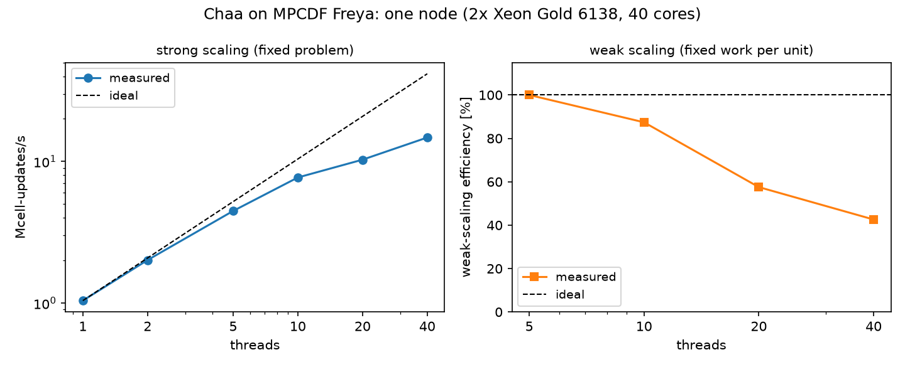
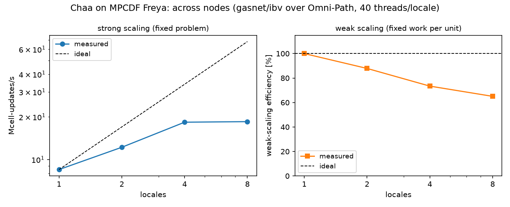
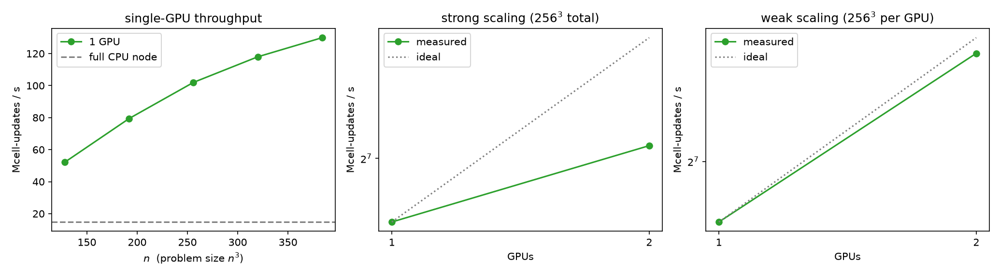
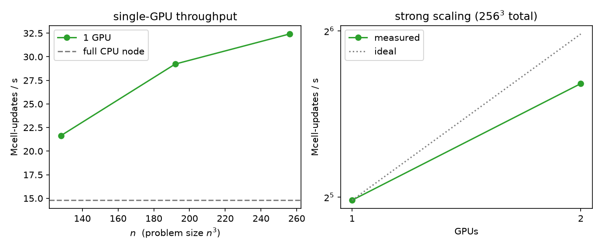
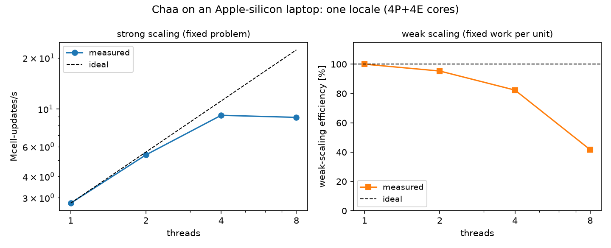
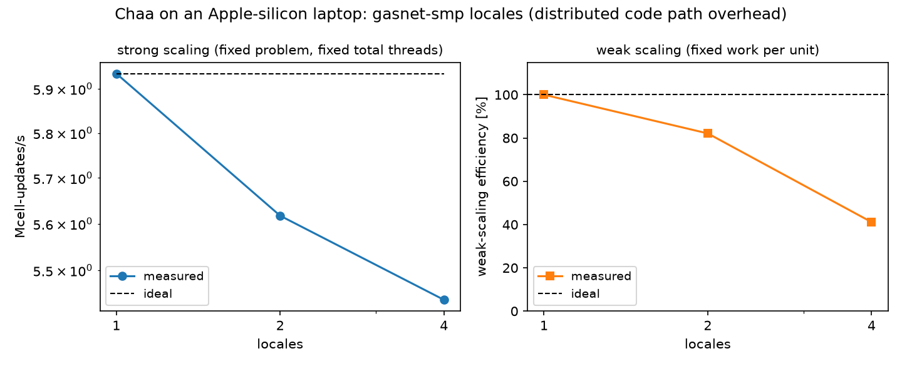

# Benchmarks & scaling

Chaa's figure of merit is the **Mcell-updates/s** printed at the end of
every run (steps × cells / wall time of the evolution loop; I/O and
setup excluded). The benchmark problem throughout is the 3D Cartesian
Sedov blast (hllc/PLM/RK2, 50 steps, no output), run by
`tools/bench.sh` (laptop) and the `tools/slurm/freya-bench-*.slurm`
scripts (cluster); the figures are produced by `tools/plot_bench.py`.

Two machines are covered: a production HPC cluster (**MPCDF Freya**)
and an Apple-silicon laptop.

## MPCDF Freya (production cluster)

**Hardware & software.** Each compute node has 2× Intel Xeon Gold 6138
(Skylake-SP, 20 cores each, 2.0 GHz base) — 40 cores and ~190 GB usable
memory per node — connected by a 100 Gb/s Intel **Omni-Path** fabric
(`hfi1`); SLES 15, SLURM. Chaa was compiled with Chapel 2.8 (C
backend, `CHPL_LLVM=none`) and gcc 14.1; the multi-locale binary uses
the GASNet-EX **ibv** conduit over Omni-Path verbs, bootstrapped by
`srun --mpi=pmix`, with one Chapel locale per node and 40 threads per
locale. HDF5 1.14.1 (serial). The complete setup and launch recipe is
in [`tools/slurm/README.md`](https://github.com/dutta-alankar/Chaa/blob/main/tools/slurm/README.md).

**Correctness first:** the full 47-case validated test suite passes on
a Freya compute node in 3 m 44 s (144 quantitative checks).

### Within one node (thread scaling, `CHPL_COMM=none`)

| threads | grid | Mcell/s | speed-up |
|---|---|---|---|
| 1 | 128³ | 1.04 | — |
| 2 | 128³ | 2.01 | 1.93× |
| 5 | 128³ | 4.47 | 4.30× |
| 10 | 128³ | 7.71 | 7.41× |
| 20 | 128³ | 10.30 | 9.90× |
| 40 | 128³ | 14.77 | 14.2× |

Weak scaling (64³ cells per 5 threads) tells the same story: 4.33 →
7.57 → 9.97 → 14.76 Mcell/s at 5/10/20/40 threads. Scaling is
near-ideal while a socket's memory bandwidth lasts and saturates
beyond ~10 cores per socket — the expected behaviour of a
bandwidth-bound stencil code on Skylake; the second socket doubles the
available bandwidth and the rate follows.



### Across nodes (gasnet/ibv, one 40-thread locale per node)

Strong scaling, fixed 256³ box:

| locales (nodes) | Mcell/s | speed-up |
|---|---|---|
| 1 | 8.50 | — |
| 2 | 12.21 | 1.44× |
| 4 | 18.35 | 2.16× |
| 8 | 18.52 | 2.18× |

Weak scaling, 256³ cells per locale:

| locales | grid | Mcell/s | efficiency |
|---|---|---|---|
| 1 | 256³ | 8.48 | — |
| 2 | 512·256·256 | 14.90 | 88 % |
| 4 | 512·512·256 | 24.90 | 73 % |
| 8 | 512³ | 44.13 | 65 % |



How to read these numbers:

- **Weak scaling is the operative regime** for a distributed
  finite-volume code: grow the problem with the machine. 512³
  (134 million cells) runs at 44 Mcell/s on 8 nodes at 65 % efficiency.
- **Strong scaling saturates** once the per-locale block gets small:
  256³ split 8 ways leaves only 2 M cells per 40-core node, and the
  per-step distributed-loop synchronisations (a fixed ~tens of ms per
  step) stop shrinking. Use ≳8 M cells per node for efficient runs.
- The multi-locale binary pays a **flat ~40 % single-locale penalty**
  versus the `CHPL_COMM=none` build (8.5 vs 14.8 Mcell/s on the same
  node) — the cost of compiling every array access for a potentially
  remote address space with the C backend. Use the single-locale build
  whenever a run fits on one node.

Two multi-locale performance lessons from this campaign are now baked
into the code (they were invisible on shared memory and dominant on a
real network): restart/gather I/O uses bulk per-plane transfers
instead of element-wise remote reads, and the grid is block-split
**only along x1**, keeping every halo plane contiguous in memory (the
default 2×2×2 locale grid on 8 locales cuts the memory-fastest axis
into tens of thousands of tiny strided RDMAs and cost a third of the
8-node throughput).

## Freya GPUs (NVIDIA A100 and V100)

**Hardware & software.** Freya's `p.gpu.ampere` partition has 4×
NVIDIA **A100**-PCIE-40GB per node (48 cores, 380 GB); `p.gpu` has 2×
**V100**-PCIE-32GB.  The GPU binaries are compiled by a separate
Chapel 2.8 installation (bundled LLVM 19, CUDA 12.8,
`CHPL_LOCALE_MODEL=gpu`, one tree per GPU architecture) with
`-DCHAA_GPU=ON`; the same benchmark problem and metric as the CPU
campaigns (3D Cartesian Sedov, evolution loop only).  Setup and
reproduction: [Running on Freya](freya.md) and
[Running on GPUs](user-guide/gpu.md).

**Correctness first:** on an A100 the GPU binary passes the whole
GPU-vs-CPU comparison matrix (15 configurations, agreement to
round-off, bit-identical stop/resume restart) **and the full
validated test suite: 46 passed, 0 failed** (`cylinder-flow` skipped
— internal BCs are CPU-only).

### Single GPU (throughput vs problem size)

| grid | A100 (Mcell/s) | V100 (Mcell/s) |
|---|---|---|
| 128³ | 52.5 | 21.6 |
| 192³ | 79.4 | 29.2 |
| 256³ | 102.0 | 32.4 |
| 320³ | 118.0 | — |
| 384³ | 129.9 | — (>32 GB) |

A single A100 reaches **129.9 Mcell/s** at 384³ — **8.8× the full
40-core CPU node** (14.8 Mcell/s).  Throughput keeps rising with
problem size as the fixed per-step costs (kernel launches, the
host-staged x1 ghost planes) amortise; a V100 delivers about a third
of an A100, consistent with its memory bandwidth.



### Multiple GPUs in one node (one process)

One process drives all GPUs that `CUDA_VISIBLE_DEVICES` exposes; the
grid splits across them along x1.

| GPUs | strong, 256³ total | weak, 256³ per GPU |
|---|---|---|
| 1× A100 | 102.4 | 101.9 |
| 2× A100 | 134.3 (1.31×) | 192.2 (94 % eff.) |
| 1× V100 | 31.6 | — |
| 2× V100 | 51.4 (1.63×) | — |

Weak scaling over two GPUs is near-ideal; strong scaling at 256³ is
partial because each block still exchanges its x1 ghost planes
through the host.  **Four GPUs in one process currently fault**
(CUDA "invalid resource handle", a Chapel 2.8 runtime limitation with
>2 concurrently driven devices) — use one locale per node (or per
GPU pair) and scale across nodes instead.



### Across nodes (GASNet/ibv, one locale per node)

Two A100 nodes with one Chapel locale each driving 2 GPUs (the same
`srun --mpi=pmix` launch as the CPU campaign, plus
`GASNET_PHYSMEM_MAX` — the GPU runtime's pinnable-memory probe must
be capped inside a job cgroup) run **correctly** — the multi-node GPU
configuration reproduces the single-locale results — but currently
**slowly**: ~4.2 Mcell/s on 2 nodes × 2 GPUs (256×128×128), far below
a single GPU.  Every stage's x1 ghost exchange travels
device → host → Omni-Path → host → device through the `StencilDist`
halo machinery, and at GPU speeds that staging dominates the step.
Scaling GPUs *within* a node is efficient (above); across nodes the
current implementation is a correctness feature, not a performance
one — direct device-to-device halo exchange is future work.

### GPU performance lessons

Four Chapel-2.8 GPU findings from this campaign are baked into the
code (details in [Running on GPUs](user-guide/gpu.md)):
kernels iterate a **flattened 1D index space** (a multidimensional
forall runs ~50–100× below memory bandwidth on device); the flux
evaluation is **split into reconstruction/solve kernels specialised
per scheme** (the fused kernel spills ~16 KB of locals per thread and
overflows the 32 KB kernel-parameter limit); **standard x2/x3
boundary conditions run on the device** (host-staging them throttled
even single-GPU runs by ~25 %); and `select` on an enum constant
inside inlined procs **miscompiles in device kernels** (if-chains are
used throughout the metric functions).

## Apple-silicon laptop (8 cores: 4 performance + 4 efficiency)

Measured with `tools/bench.sh`, Chapel 2.8 (LLVM backend), macOS.

Single locale (`CHPL_COMM=none`), strong scaling at 128³:

| threads | Mcell/s | speed-up |
|---|---|---|
| 1 | 2.79 | — |
| 2 | 5.37 | 1.92× |
| 4 | 9.18 | 3.29× |
| 8 | 8.93 | 3.20× |

Weak scaling (64³ per thread): 2.73 / 5.21 / 9.00 / 9.12 Mcell/s at
1/2/4/8 threads. The 4 efficiency cores add nothing to this
bandwidth-bound kernel — 4 threads is the sweet spot (the weak-scaling
drop at 8 "threads" is the same effect: the extra 4 units of work land
on E-cores that contribute no additional throughput).



Multi-locale (GASNet **smp** conduit, all locales on the one machine,
fixed 8 threads total — this isolates the distributed code path's
overhead, not network scaling):

| locales × threads | Mcell/s (strong, 128³) |
|---|---|
| 1 × 8 | 5.93 |
| 2 × 4 | 5.62 |
| 4 × 2 | 5.44 |

i.e. ~8 % total cost for splitting the box four ways over shared
memory (note the flat ideal line in the strong-scaling panel below:
total compute resources are held fixed, so perfection is *no loss*,
not linear speed-up). Multi-locale correctness is verified here too:
4-locale piece output reassembles to the single-locale fields to
machine precision (2.6×10⁻¹⁵) and particle trajectories match to
10⁻¹².



## Reproducing

```sh
# laptop / any shared-memory machine:
tools/bench.sh | tee bench.out            # single-locale thread scaling
tools/bench.sh build-gasnet/bin/chaa 4 | tee bench.out   # + gasnet-smp locales
python tools/plot_bench.py bench.out --select single-locale --save laptop-node.png
python tools/plot_bench.py bench.out --select multi-locale  --save laptop-multi.png

# cluster (Freya; adapt modules/substrate elsewhere):
sbatch      tools/slurm/freya-bench-node.slurm
sbatch -N 8 tools/slurm/freya-bench-multi.slurm
python tools/plot_bench.py chaa-bench-node-*.out  --save node.png
python tools/plot_bench.py chaa-bench-multi-*.out --save multi.png
```

See [Running in parallel](user-guide/parallel.md) for building the
multi-locale runtime and [`tools/slurm/README.md`](https://github.com/dutta-alankar/Chaa/blob/main/tools/slurm/README.md)
for the full cluster recipe.
