# Test problems in detail

One section per bundled problem: physical setup, how Chaa runs it, what
is validated, and the **measured results** (Apple Silicon, Chapel 2.8;
identical checks run in CI on every push). Canonical configurations
live in `src/problems/<name>_runtime_params.ini`; resolutions below are
the CI settings.

Every case can be plotted with the bundled tools (details in
[Plotting & analysis](user-guide/plotting.md)):

```sh
tests/run_case.sh <case>                          # run -> test-output/<case>
python tools/plot_fields.py test-output/<case>    # initial vs final fields
python tools/plot_compare.py <kind> test-output/<case>   # vs analytic
```

where `<kind>` is listed per problem below when an analytic reference
exists (`sod`, `sod-iso`, `sedov`, `taylor-couette`, `thermal-wave`,
`cooling`, `linear-wave`, `vortex`, `epicycle`).

The figures on this page were produced with exactly those tools —
regenerate the whole gallery from scratch (runs + plots) with
`PY=<python> tools/make_gallery.sh`.

---

## sod — Sod shock tube

Riemann problem (ρ,v,p) = (1,0,1)|(0.125,0,0.1), γ=1.4, split at
x₀=0.5; the solution is a left rarefaction, contact and right shock.
The first tracer field dyes the left state, so the dye edge must ride
the contact discontinuity. Runs in any geometry (radial shock tube in
cylindrical/spherical with `--bcX1min=axis`).

**Validation & results**
- vs the **exact Riemann solution** (Toro solver in
  `tests/validate/exact_riemann.py`): L1(ρ)=1.6×10⁻³ at 400 cells
  (`sod-1d-cart`); 1.5×10⁻³ with `--riemann=exact` (`sod-1d-exact`).
- isothermal variant vs the exact **two-wave isothermal** solution
  (`sod-1d-iso`); p=ρcs² holds to round-off.
- tracer dye bounded in [0,1], edge at the contact x=0.689 (exact
  0.685) (`sod-from-ini`).
- on stretched grids: L1(ρ)=2.0×10⁻³ with a 5× spacing range
  (`sod-1d-stretch`), 1.8×10⁻³ with a 100-cell uniform anchor + 1 %
  geometric growth (`sod-stretch-anchor`).
- **cross-code**: L1(ρ) = 2.7×10⁻⁴ against Idefix (roe) and 5.6×10⁻⁴
  against AthenaPK (hlle/vl2) at matched configurations — six times
  closer than either code is to the exact solution
  (`ref-sod-idefix`, `ref-sod-athenapk`, `ref-sodiso-idefix`).

Plot: `python tools/plot_compare.py sod test-output/sod-1d-cart`
(`sod-iso` for the isothermal variant).


*Density (blue) and pressure (orange) at t=0.2 over the exact solution
(black): rarefaction fan, contact and shock all land on the analytic
curves; the L1 error in the title is what CI thresholds.*

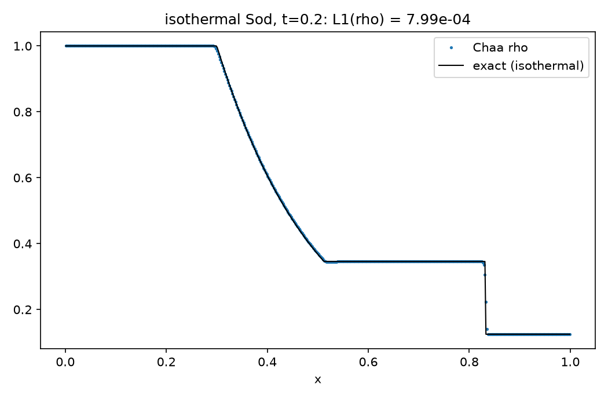
*The isothermal variant against the exact two-wave (no contact)
isothermal Riemann solution.*

## twoblast — Woodward & Colella interacting blast waves

p = 1000 | 0.01 | 100 on [0,1] with reflecting walls, γ=1.4, t=0.038;
two strong shocks collide. **Result:** peak density 6.07 at x=0.781
(reference ≈6 at ≈0.78) at 800 cells.

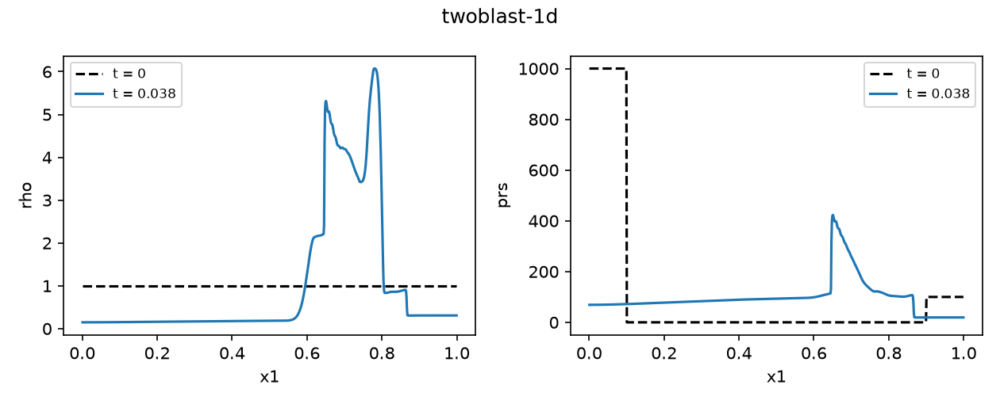
*Initial (dashed) and t=0.038 (solid) profiles: the two blasts have
collided, producing the narrow density spike near x≈0.78.*

## sedov — Sedov–Taylor point explosion

Energy E₀ deposited as thermal pressure inside r<sedovR0; the deposit
volume is *measured on the actual mesh* (inactive angular directions
contribute their full measure), so the similarity solution
R(t)=(Et²/αρ)^{1/5} (α from Kamm & Timmes) applies unchanged in every
geometry and dimensionality.

**Results**
- 1D spherical (512 cells): radius error **0.43 %** (`sedov-1d-sph`);
  on a logarithmic grid with a 117× spacing range: **0.28 %**
  (`sedov-1d-log`).
- 2D (R,z) cylindrical: spherical to **0.01 %** between the R and z
  axes (`sedov-2d-cyl`); 2D (r,θ): radius independent of θ to machine
  precision (`sedov-2d-sph`).
- 3D Cartesian 64³: 3 % radius, exact octant symmetry
  (`sedov-3d-cart`); γ=5/3 variant matches the similarity radius
  (`sedov-3d-idefix`).
- 3D spherical (r,θ,φ): radius angle-independent to round-off
  (`sedov-3d-sph`).
- **cross-code**: the 64³ radial density profile agrees with Idefix's
  SedovBlastWave to **3.3×10⁻⁴** relative L1 — the profile peaks match
  to three decimals (`ref-sedov3d-idefix`).

Plot: `python tools/plot_compare.py sedov test-output/sedov-1d-sph`
(works on every Sedov case; `--gamma 1.6666667` for the Idefix
variant), `python tools/plot_fields.py test-output/sedov-2d-cyl --log rho`.


*1D spherical profile at t=0.5: the density peak sits on the analytic
similarity radius R=(Et²/αρ)^(1/5) (dashed).*

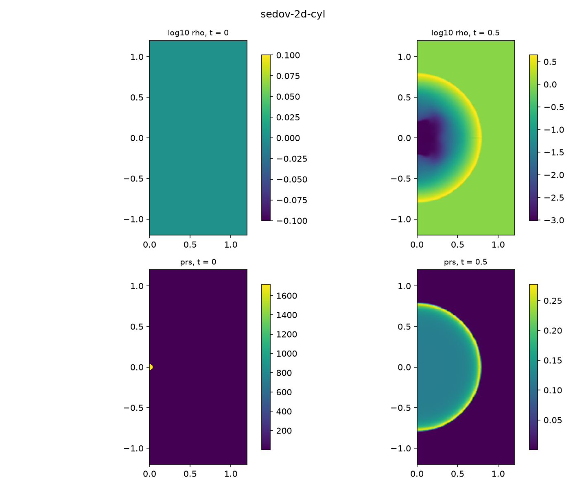
*The 2D cylindrical (R,z) run: the point deposit on the axis (left)
becomes a shell that is spherical to 0.01 % between the R and z
directions (right; log₁₀ρ).*


*3D Cartesian run, x3 mid-plane slice (`--slice x3,0.5`).*


*The same 3D run cut off-centre (`--slice x1,0.75` at x1≈0.62): the
plane intersects the spherical shell in the expected smaller ring.*

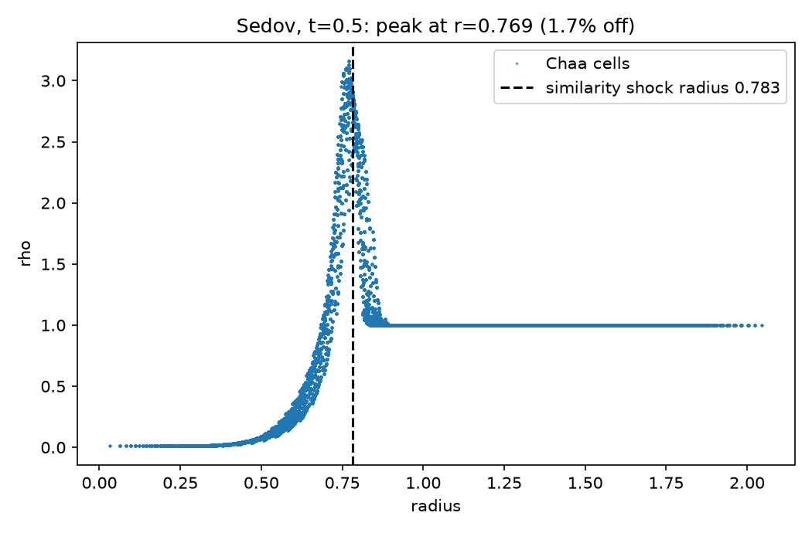
*Every cell of the 64³ box plotted against radius: the scatter is the
angular spread (tight), and the peak lands on the similarity radius.*

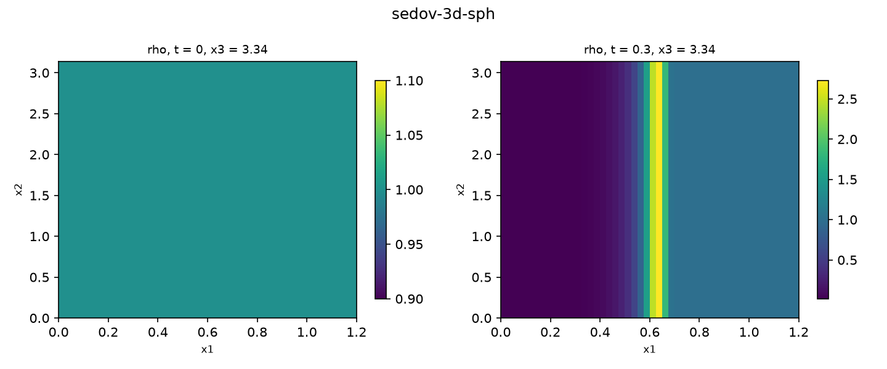
*The 3D spherical-coordinate run, φ mid-plane slice in native (r,θ)
coordinates: the shock front is a straight line at constant r, i.e.
angle-independent to round-off.*

## blast — over-pressured region

PLUTO-style circular/spherical pressure jump (blastPin/blastPout inside
blastR0). Used to certify curvilinear symmetry: mirror-symmetric to
2.6×10⁻¹⁵ in 2D polar (`blast-2d-polar`), φ- and z-symmetric to 10⁻¹⁵
in 3D (R,φ,z) (`blast-3d-polar`).


*The 2D (R,φ) run drawn on the physically mapped annulus (the mesh
nodes stored in the dumps): the off-centre blast expands as a circle in
physical space even though the grid is polar.*

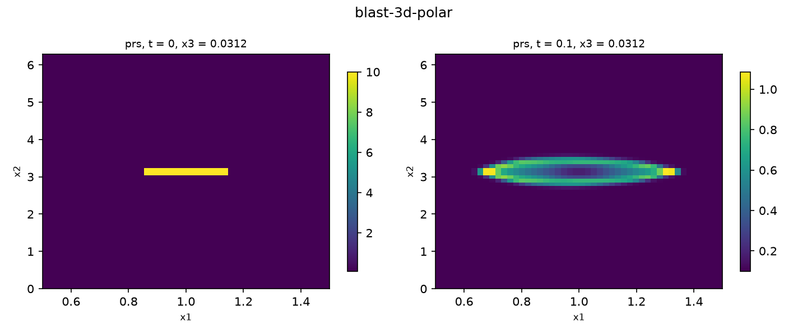
*The 3D (R,φ,z) variant, z mid-plane slice in native (R,φ)
coordinates: the pressure front is symmetric about the blast centre in
φ to round-off.*

## riemann2d — Lax & Liu configuration 3

Four-quadrant 2D Riemann problem, [0,1]², t=0.3. The initial data are
symmetric across the diagonal, so the solution must be too:
**asymmetry 1.2×10⁻¹⁴**, density within physical bounds, ρmax = 1.78
(`riemann2d`).

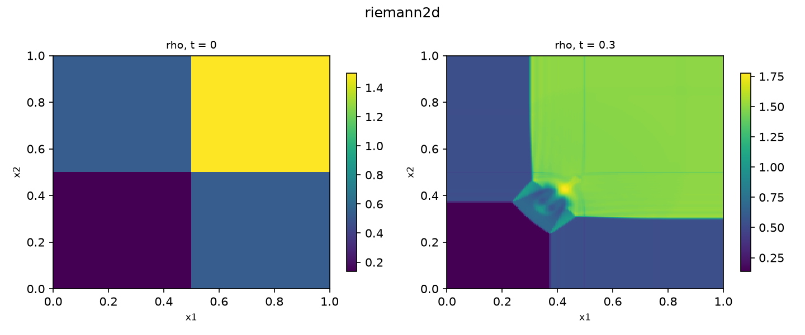
*Density at t=0.3: the four-shock interaction with its characteristic
mushroom jet along the diagonal — visibly (and measurably) symmetric.*

## dmr — double Mach reflection

Mach-10 shock incident at 60° on a reflecting wall (Woodward & Colella;
identical to Idefix's MachReflection): post-shock state
(8, 8.25 sin60°, −8.25 cos60°, 116.5), time-dependent exact-shock top
boundary via the `userdef` hook. **Results:** Mach stem foot at x=2.77
(literature 2.75–2.8), ρmax=21.3 at 256×64 (`dmr`); at Idefix's 480×120
resolution the full density field agrees with Idefix to **0.31 %**
relative L1 with ρmax 22.00 vs 22.01 (`ref-machref-idefix`).

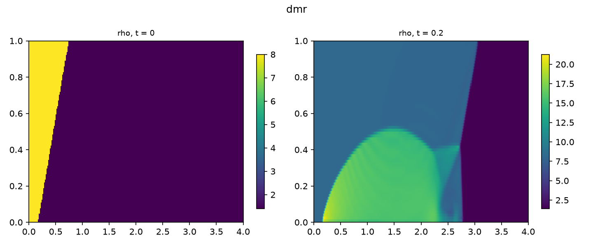
*Density at t=0.2: incident shock, curved reflected shock and the Mach
stem with its slip-line jet along the wall.*

## kh / khi — Kelvin–Helmholtz instability

`kh`: adiabatic double shear layer with a localised seed and a tracer
dye on the inner stream; growth of v_y by >10× by t=1.5 (`kh`).
`khi`: Idefix's isothermal version (cs=10, wavy interface); seeded
growth to max|v_y|≈0.7 by t=1 (`khi-2d-iso`); the kinetic-energy
diagnostic ⟨v_y²⟩ agrees with Idefix within 13 % at t=1 (nonlinear
stage — field-by-field comparison is not meaningful for an
instability).


*Density (top) and the passive tracer dye (bottom) at t=0 and t=1.5:
the shear layers roll up into the classic billows, and the dye — which
initially marks the dense stream exactly — stays bounded in [0,1] while
being wound into the vortices.*

## rt — Rayleigh–Taylor instability

Heavy-over-light hydrostatic layer (ρ 2|1, p hydrostatic under
`--grav2=-0.1`) with a single-mode seed; mode growth and bounded
densities by t=5 (`rt`).

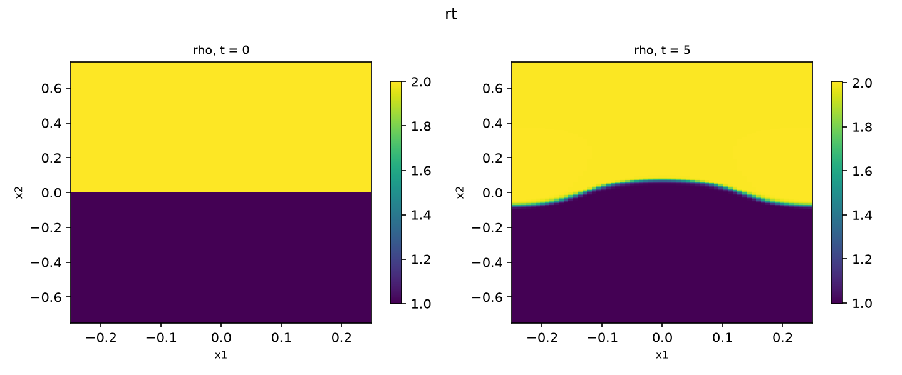
*The seeded single mode grows into the falling spike and rising bubble;
densities stay within the initial bounds.*

## vortex — isentropic vortex

Smooth vortex advected diagonally; after one period the exact solution
is the initial condition. **The accuracy ladder** (64², L1(ρ)):
`linear` 2.1×10⁻³ → `limo3` 9.5×10⁻⁴ → `ppm`+rk3 2.2×10⁻⁴; mass
conserved to round-off (`vortex`, `vortex-limo3`, `vortex-ppm`). Also
hosts the tracer-particle tests: 64 randomly scattered particles
return to their start after one period (`vortex-particles`), and 64
particles seeded on a ring of radius 1.5 by the `problemParticleInit`
hook (`--partRingR=1.5`) keep their radius to 0.4 % and rotate at the
analytic rate ω(R)=β/2π·e^{(1−R²)/2} to ~2 % (`vortex-particles-ring`).

Plot: `python tools/plot_compare.py vortex test-output/vortex`;
`python tools/plot_fields.py test-output/vortex-particles-ring`
overplots the particle ring on the vortex.

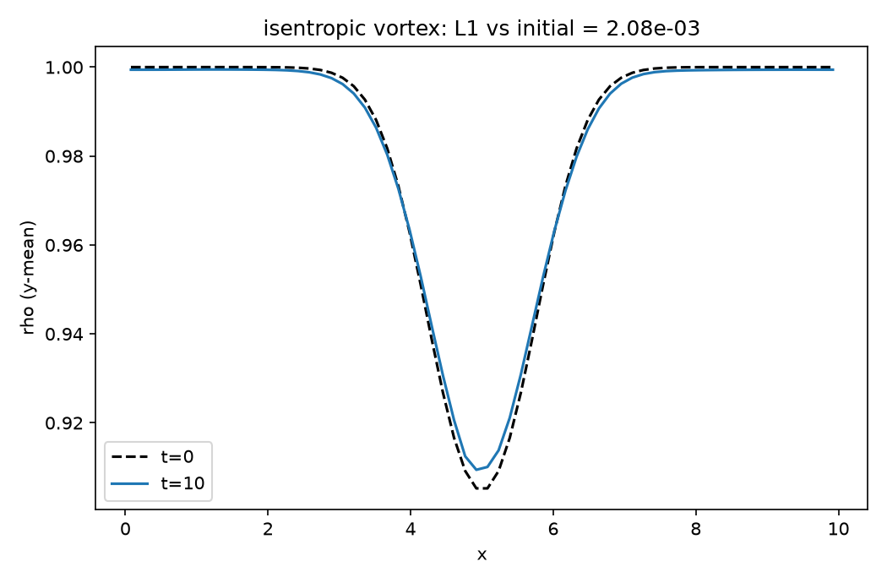
*The y-averaged density after one full advection period (solid) on the
initial condition (dashed) — for this problem the initial state is the
exact solution, so the gap is pure scheme error.*

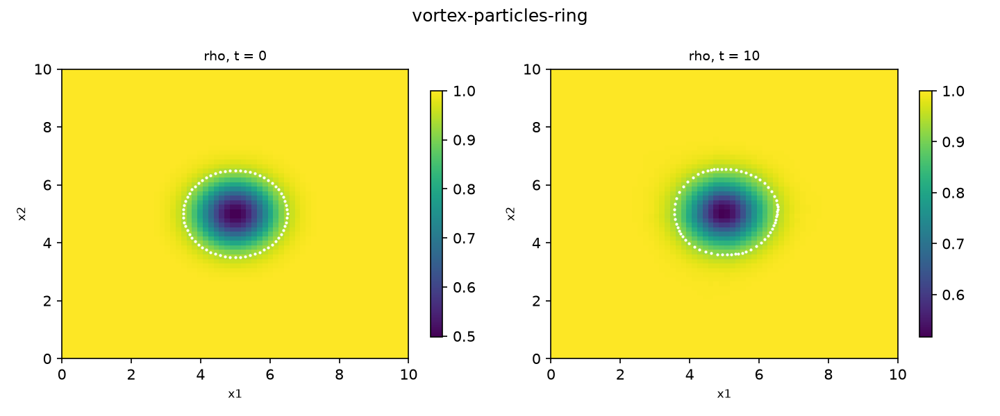
*Tracer particles (white) seeded on a ring of radius 1.5 by the
`problemParticleInit` hook, at t=0 and after one period: the ring has
translated with the vortex, rotated by the analytic angle, and stayed a
ring.*

## linearWave — acoustic eigenmode

Travelling sound wave of amplitude 10⁻⁴ on a periodic box; after one
period the L1 error against the initial condition measures pure scheme
dissipation. **Result:** `wenoz`+`vl2` keep the eigenmode to
**3×10⁻⁴ of its amplitude** (`linear-wave`). Cross-code: at AthenaPK's
configuration the dissipation agrees within 2× (and a deliberately
unstable rk1+PLM run reproduces AthenaPK's instability growth to 2 %).

Plot: `python tools/plot_compare.py linear-wave test-output/linear-wave`.

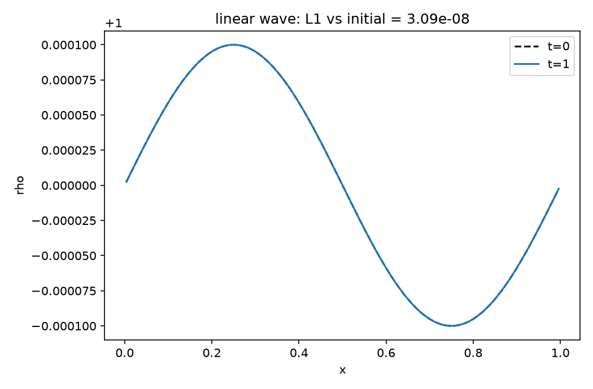
*The 10⁻⁴-amplitude eigenmode after one period (solid) on its initial
state (dashed): with `wenoz`+`vl2` the two are indistinguishable at
this scale.*

## thermalWave — conduction tests

Sinusoidal density (hence temperature) perturbation at uniform
pressure. Two regimes: the slow-conduction limit decays at the analytic
constant-pressure rate Γ=κ(γ−1)k²/γ — measured to **3 %**
(`thermal-diffusion`); with `--coolLambda0` instead of κ it becomes the
cooling test — the exact Townsend integration matches the analytic
power-law solution to **round-off** (`cooling-box`). Cross-code note:
Idefix's thermalDiffusion test zeroes the velocity field every step to
isolate conduction; with the hydro response included the δT decay
agrees with Idefix to 3 %.

Plot: `python tools/plot_compare.py thermal-wave
test-output/thermal-diffusion` and `python tools/plot_compare.py
cooling test-output/cooling-box`.

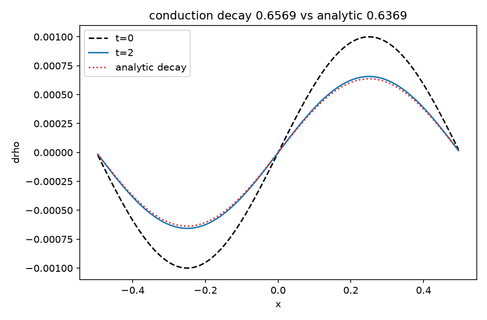
*The δρ profile at t=0 and t=2 with the analytically decayed initial
profile (dotted) on top of the simulated final state.*

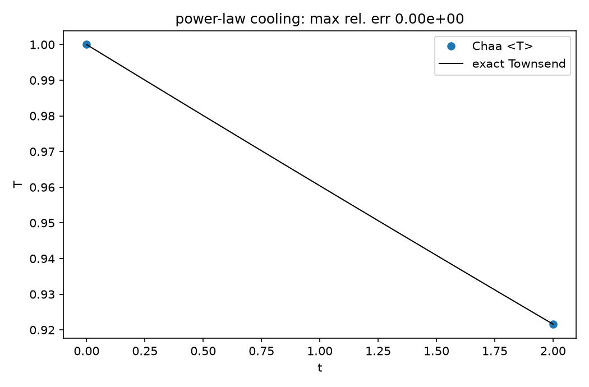
*Box-mean temperature (points) on the exact power-law cooling solution
(line): the Townsend integrator reproduces it to round-off, at any
time step.*

## taylorCouette — viscous rotating cylinders

1D cylindrical gap R∈[1,2], no-slip rotating walls via `userdef`
ghosts. **Result:** steady v_φ(R) matches the analytic Couette profile
aR + b/R to **0.35 %** (`taylor-couette`).

Plot: `python tools/plot_compare.py taylor-couette test-output/taylor-couette`.


*Steady-state v_φ(R) (points) on the analytic Couette profile aR + b/R
(line).*

## cylinderFlow — viscous flow past a cylinder

2D wind tunnel with an immersed solid disc (`solveMask` internal
boundary), `--mu` viscosity, inflow/diode boundaries. **Results:**
exact no-slip inside the solid, recirculating wake (v_x<0 behind the
cylinder) at Re=60 (`cylinder-flow`).

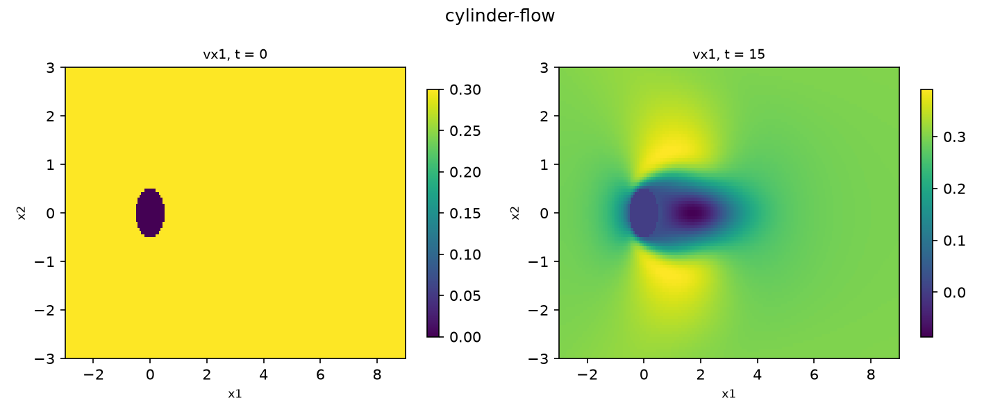
*Streamwise velocity v_x at t=0 and t=15: the immersed solid (dark
disc, exactly zero inside) sheds a recirculating wake with reversed
flow behind the cylinder.*

## diskCavity — rotating disk with a density cavity

Idefix's RWI-cavity profile: Σ ∝ tanh cavity, locally isothermal
cs = h₀/√R, central gravity, exact rotational-equilibrium initial
velocity. **Results:** v_φ drift < 0.12 % over 10 t.u., Keplerian to
0.94 % outside the cavity (`disk-cavity`); identical equilibrium with
**FARGO orbital advection** enabled (`disk-cavity-fargo`).

## cloud — wind-cloud interaction

AthenaPK-style cloud-in-wind: χ=10 cloud in pressure equilibrium with a
Mach-1.5 wind, dyed by a tracer, inflow + outflow-diode boundaries.
**Results:** dye bounded in [0,1], dyed material tracked downstream,
dense core survives to t=2 (`cloud-wind`).

## turbulence — driven turbulence

Isothermal periodic box stirred by the OU spectral forcing module, with
a half-box dye. **Results:** v_rms ≈ 1.05 (target Mach ~1) by t=3, dye
std drops 0.5 → 0.12 (mixing), tracer bounded (`turbulence-2d`).

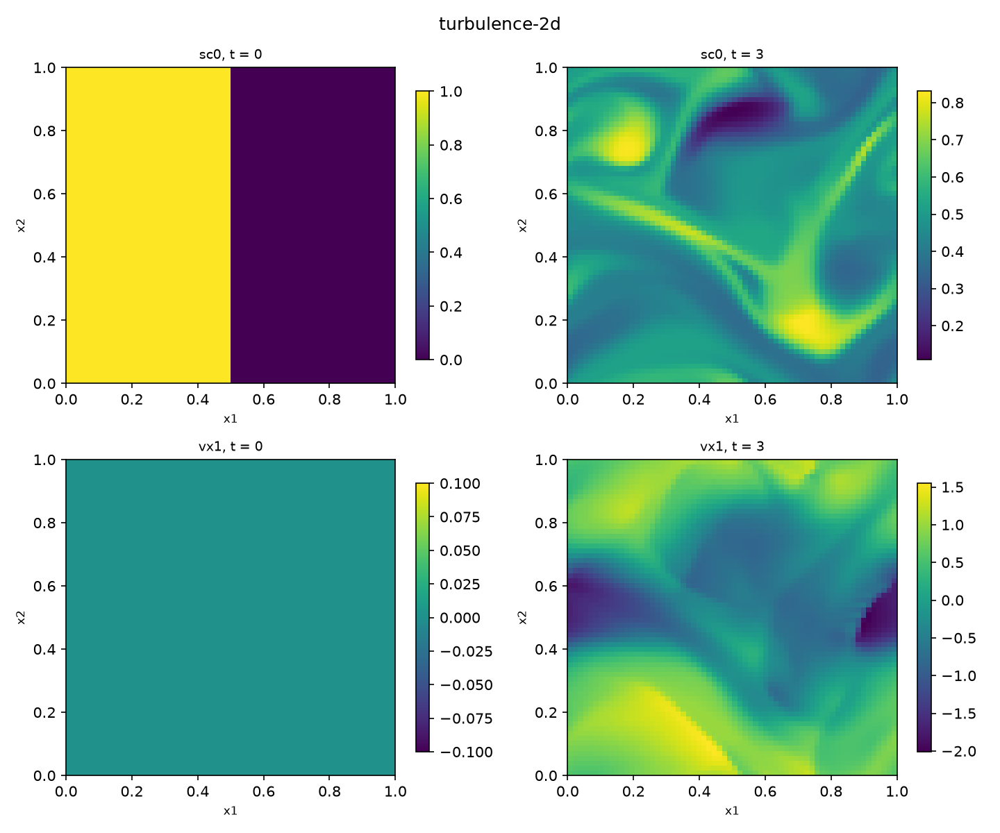
*The half-box dye (top) is stirred and mixed by the OU-driven velocity
field (bottom) while staying bounded in [0,1].*

## epicycle — shearing-box oscillation

Equilibrium shear flow v_y=−qΩx plus a uniform radial kick; the kick
oscillates at the epicyclic frequency κ=√(2(2−q))Ω. **Results:**
⟨v_x⟩(t=π/κ) = −waveAmp to five digits, with and without FARGO
(`epicycle-shearbox`, `epicycle-fargo`).

Plot the whole oscillation by re-running with dumps enabled:
`--outDt=0.3 --tstop=12.57`, then
`python tools/plot_compare.py epicycle <outdir>`.


*Box-mean v_x over two epicyclic periods (points) on A·cos(κt) with
κ=√(2(2−q))Ω (line): frequency and amplitude are reproduced — the
quantitative anchor of the shearing-box sources, shear-periodic
boundaries and FARGO.*

## Self-gravity verification

`selfgrav-kick`: a sinusoidal density field is given one tiny Euler
step under `--sgFourPiG=1`; the resulting velocity equals the analytic
−∇Φ·dt of the Poisson solution to **0.08 %** — solver and coupling
verified end-to-end.

---

See [Cross-code validation](cross-validation.md) for how the frozen
Idefix/AthenaPK reference profiles used by the `ref-*` cases were
produced.
