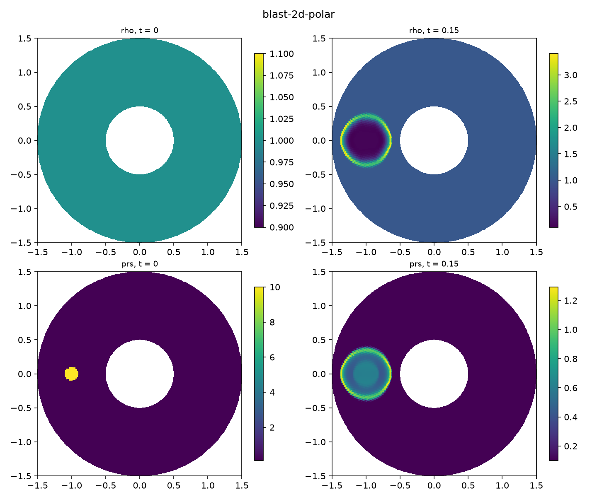
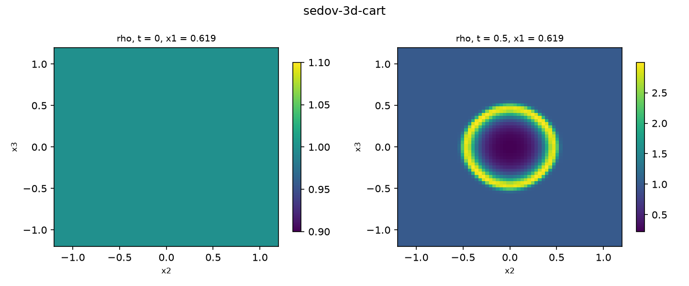

# Plotting & analysis

`tools/` ships two python scripts that work on **any** Chaa output
directory (txt, single-file HDF5, or multi-locale `.locN` piece files —
pieces are reassembled onto the global grid transparently). They need
`numpy`, `matplotlib` and, for HDF5 runs, `h5py`:

```sh
python -m venv venv && venv/bin/pip install numpy matplotlib h5py
```

## `plot_fields.py` — look at the fields

Visualise the initial and final (or any) dumps of a run:

```sh
python tools/plot_fields.py test-output/sod-1d-cart              # 1D lines
python tools/plot_fields.py test-output/kh --fields rho,sc0      # 2D maps
python tools/plot_fields.py test-output/sedov-2d-cyl --log rho   # log scale
python tools/plot_fields.py test-output/sedov-3d-cart            # 3D mid-plane
python tools/plot_fields.py output/ --dumps 0,5,9 --save fig.png
```

- **1D** runs: line plots per field, initial dashed and final solid;
- **2D** runs: pseudocolor maps in physical coordinates — curvilinear
  meshes (annuli, wedges, shells) are drawn *mapped*, using the node
  positions stored in the dumps;
- **3D** runs: **slice plots** — the x3 mid-plane by default, any
  axis/position with `--slice x1|x2|x3[,frac]`
  (e.g. `--slice x1,0.75` cuts the plane at 75 % of the x1 extent);
- tracer **particles**, when present, are overplotted on Cartesian 2D
  maps.

Options: `--dumps n0,n1,…` (default first,last), `--fields …` (default
`rho,prs` + `vx1` in 1D), `--log field,…`, `--cmap name`,
`--slice …` (3D), `--save file.png`.


*`plot_fields.py` on a 2D polar run: the mesh is drawn physically
mapped, so the annulus (and the circular blast in it) look right.*


*A 3D run sliced off-centre with `--slice x1,0.75`: the plane cuts the
spherical shock shell in a smaller ring, as it should.*

## `plot_compare.py` — check against the analytic estimate

For the test problems with an exact/analytic reference, overlay the
simulation on it and print the error in the title:

| kind | analytic reference | try it on |
|---|---|---|
| `sod` | exact Riemann solution (Toro sampling) | `test-output/sod-1d-cart` |
| `sod-iso` | exact isothermal Riemann solution | `test-output/sod-1d-iso` |
| `sedov` | Sedov–Taylor similarity shock radius (Kamm & Timmes α) | any `sedov-*` run |
| `taylor-couette` | analytic steady Couette profile aR + b/R | `test-output/taylor-couette` |
| `thermal-wave` | conduction decay e^(−κ(γ−1)k²t/γ) | `test-output/thermal-diffusion` |
| `cooling` | exact Townsend power-law cooling T(t) | `test-output/cooling-box` |
| `linear-wave` | the initial eigenmode (returns each period) | `test-output/linear-wave` |
| `vortex` | the initial vortex (exact after one period) | `test-output/vortex` |
| `epicycle` | epicyclic oscillation ⟨v_x⟩ = A cos(κt) | a shearing-box run with `--outDt` |

```sh
python tools/plot_compare.py sod test-output/sod-1d-cart
python tools/plot_compare.py sedov test-output/sedov-1d-sph
python tools/plot_compare.py sedov test-output/sedov-3d-cart --gamma 1.4
python tools/plot_compare.py epicycle out-epi --omega 1 --q 1.5 --amp 0.01
```

Every kind takes `--save fig.png`; problem parameters that enter the
analytic solution (γ, κ, Λ₀, Ω, …) have flags matching the run
defaults — `python tools/plot_compare.py --help` lists them. The
analytic solutions are the same modules the CI validators use
(`tests/validate/exact_riemann.py`, `common.py`), so the plots show
exactly what CI checks.


*`plot_compare.py sod`: simulation points over the exact solution, the
L1 error in the title.*

The whole figure gallery used across this documentation (one plot per
test problem, comparisons and field maps) lives in `docs/assets/plots/`
and is regenerated from scratch — runs included — by

```sh
PY=/path/to/python tools/make_gallery.sh
```

There is also `tools/plot_bench.py`, which turns the output of the
benchmark scripts (`tools/bench.sh`, `tools/slurm/freya-bench-*`) into
the strong/weak scaling figures on the
[benchmarks page](../benchmarks.md).

## Programmatic access

`tools/chaa_io.py` is a small reader library you can import from your
own scripts:

```python
import sys; sys.path.insert(0, "tools")
from chaa_io import Dump, dump_ids, load_particles

d  = Dump("output/")          # last dump; Dump("output/", num=0) for the first
rho = d["rho"]                # (nx3, nx2, nx1) numpy array
x   = d.x1c                   # native cell-centre coordinates
xn, yn = d.nodes or (None, None)   # mapped nodes on curvilinear 2D meshes
print(d.time, d.ndim, d.fields)
p = load_particles("output/")      # (n, 4): id, x, y, z — or None
```

It handles multi-locale piece output transparently (pieces are placed
onto the global grid by their coordinate ranges), so analysis scripts
never need to care how many locales wrote a dump. To materialise the
combined data as ordinary single files instead, use
`python tools/combine_pieces.py <outdir>`
([Output & visualisation](output.md)).
